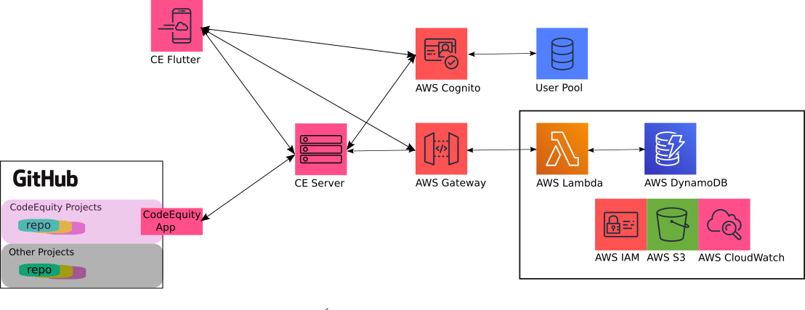

# CodeEquity

CodeEquity is based on a simple truth: ***If you help create something, you should
be among those that benefit from it***.

Traditional established companies pay employee salaries, promise stability, and provide many perks
including insurance, retirement plans, office space, computing environments, lots of free coffee and
more.  In return, those companies own all of the output of every one of their employees.  Startup
companies are similar, but in place of stability, retirement plans, and competitive wages,
they offer small amounts of equity in order to attract skilled employees.

There are other models for organizing teams to create products.  GitHub provides a space for the
primary alternative today in the software development world.  Most new ventures in the GitHub space do not
offer money or equity to compensate skilled contributors.  Nor do they offer office space, insurance,
retirement plans, or lots of free coffee.  Instead, they offer social recognition and a sense of
purpose.  These incentives can be powerful, but only up to a point. 

CodeEquity proposes that these new ventures additionally offer up their primary currency,
***ownership***, as the key incentive to attract skilled contributors.  CodeEquity is both a legal
framework, and a software framework, that makes this simple idea easy to put into practice, and
iron-clad should the venture become successful down the road.

In the big picture, CodeEquity is an attack on the greatest remaining barrier to large scale
technical innovation: the human factor.  Up until now, the necessary ingredients for a
venture to take off have been: lots of money to pay for wages, stuff and services; some luck; and a good
idea.  Some luck and a good idea will always be necessary components for success, but startup money?
The underlying equation has changed over the last decade, with the advent of dependable internet, and
cloud-based compute services, code and project management.  We no longer need most of the trappings
of a traditional company. What's left is the human factor: How
do you attract several person-years of skilled, dedicated help without the money to pay wages?
Fully sharing equity is the only answer that has a chance to reshape or destroy this final 
blocker to full merit-based technical innovation.

How much more dynamic, inventive and sizeable would the GitHub community be if contributors saw the
potential, however slight, of making a living or better by contributing to a project?

For the *potential contributor* the choice is clear.  All else being equal between two projects of
equal merit, one of which is a CodeEquity project, and one which is not, why contribute to the
project that does not share equity?

For the *founders*, the choice is easy as well.  Most new ventures find it hard to attract skilled
contributors.  Is there a more powerful way to attract them than by offering equity?  Yes, it will
reduce the equity you can retain personally, but the equity you do retain has a much higher chance
of being worth something down the road if you can get good help early on.

For the potential contributor to CodeEquity software itself, well, yes, we are a CodeEquity project,
so consider joining the team!

:arrow_right: **Please see the [CodeEquity manual](docs/ceManual.md)
for full details.** :arrow_left:

## CodeEquity Key Concepts

Equity in a CodeEquity project is earned by making contributions to that project.  In a typical
company, equity is granted once a year to a person privately based on the subjective
evaluation of that person's boss.  In contrast, equity in a CodeEquity project can be earned at any point during
the year.  The equity value of any contribution is known to all, up front, and the accrual of equity
is both objective and public.

Several common CodeEquity terms and concepts are introduced below, primarily to help make
the manual concise and understandable.  These introductions are for common reference only.  For
binding definitions and details, refer to the **CodeEquity Venture Equity Agreement**.

### CodeEquity Ventures & Projects

A CodeEquity Venture is analogous to a company.  A CodeEquity Project is analogous to a project, or
part of a project within a company.

For example, Jessie has a great idea for an app that allows people within a community to browse,
borrow and loan books with each-other, and has decided to pursue this idea within the CodeEquity
framework.  Jessie is calling the app "BookShare".  To simplify planning, Jessie decides to break the app
development, planning and tracking into several projects: *BookShare frontend*, *BookShare backend*, and *BookShare
operations*.  In this example, the CodeEquity Venture is BookShare.  The Venture is made up of three
CodeEquity Projects: *BookShare frontend*, *BookShare backend*, and *BookShare operations*.
CodeEquity will track and collate provisional equity across the three projects and report it within
the umbrella of the Venture: BookShare.

### Provisional Equity (PEQ)

In point of fact, *equity* is not earned in CodeEquity Ventures, but rather *provisional equity* is.
Equity in a company requires the company to exist as a legal entity such as an LLC or a Corporation.
This is not a useful step for most early ventures, since it takes time and money to set up, time
that is better spent on developing and testing the ideas for the venture.

Provisional equity are normal stock options, provisional on the venture being converted into a legal
business entity at some point in the future.  The CodeEquity promise, secured by the CodeEquity legal framework, is that every
share of provisional equity owned by a contributor will be converted 1:1 to a stock option in any
company created from the venture.  Furthermore, any revenue gained by a CodeEquity Venture (for
example, with the sale of related intellectual property) that is not fed back into the venture will
be split among contributors according to how many shares of Provisional Equity they have.

For binding definitions and details, refer to **Provisional Stock Options** in the **CodeEquity Venture Equity Agreement**.  
For simplicity of reference throughout CodeEquity, one provisional stock option is denoted as *1 PEQ*,
or *one share of provisional equity*.

### PEQ Issues

A CodeEquity Project will normally be planned and tracked with a collection of *issues* managed 
with project management software, such as GitHub project boards.  Common issues
involve planned features, feature requests, and bug reports.

A PEQ issue is any issue that has a PEQ value attached to it.  For example, the *BookShare frontend*
project might have an issue: "Add book detail page".  Without an associated PEQ value, this is not a
PEQ issue.  Once Jessie adds, say, a "1000 PEQ" label to the issue, it becomes a PEQ issue and will
be subsequently tracked by CodeEquity software.

### CodeEquity Software Framework Mandate

All elements of CodeEquity's software exist to aid in tracking and managing the provisional equity
associated with a CodeEquity Venture.  This responsibility lasts up until when the Venture converts
to a legal corporate entity and the provisional shares are converted to stock options in that new
entity, at which point the new legal entity takes over.

To support this mandate, CodeEquity software tracks and stores every action that impacts the
resolution of every PEQ issue.  Likewise, CodeEquity is free to ignore actions that
have no impact on the resolution of non-PEQ issues.  For example, CodeEquity tracks
operations like adding a PEQ label to an issue, closing a PEQ issue, or changing who is assigned to
a PEQ issue.  For example, CodeEquity ignores operations like creating an issue that does not have a
PEQ label, adding a comment to an issue, or changing the name of a project column that does not have
associated PEQ issues.

CodeEquity ensures that once PEQs have accrued (i.e. provisional equity has
been earned by a contributor), all characteristics of those PEQs are immutable.  For example, if
Alex earned 1000 PEQs for implementing a new feature for BookShare, they can not be taken away or
changed down the road.

# CodeEquity Architecture Overview

CodeEquity is composed of the following major components:

  

 

* **CodeEquity GitHub App**.  A GitHub app that converts projects in a GitHub repository into CodeEquity projects.
* **CE Flutter**.  A multi-platform front end for managing CodeEquity projects.
* **CE Server**.  A Node.js Express server that handles requests from the CodeEquity GitHub App and
                  CE Flutter, and manages all related modifications to provisional equity.  
* **AWS Backend**.  A serverless backend for CE Server responsible for storing and supplying all data
                and updates related to provisional equity.

### Overview: CodeEquity App for GitHub

The CodeEquity App for GitHub is (XXX or will be) available in the GitHub Marketplace.  The CodeEquity
App connects an organization's GitHub repositories to CE Server, by means of the GitHub notification system.
Once installed, any 
[repository](https://docs.github.com/en/repositories/creating-and-managing-repositories/about-repositories)
can be transformed or added into a CodeEquity project.

The CodeEquity App is actually just a cohesive set of notification requests and permissions that allow
GitHub and CE Server to begin communicating.  As such, the app has no logic or state specific to it.

### Overview: CE Flutter

CE Flutter is a Flutter app for desktop and mobile devices that is used to manage CodeEquity
projects.  CE Flutter communicates directly with the AWS backend for provenance related to
provisional equity, collaborator agreements, equity agreements and more. 

### Overview: CE Server

CE Server is a Node.js Express server.  CE Server has two primary functions for CodeEquity projects
in a GitHub repository.  First, it records all interactions with provisional equity-related issues,
cards, columns and labels in order to fully track the provenance of all related provisional equity.
Second, CE Server makes changes on behalf of a user in the CodeEquity project in GitHub to ensure
the project remains in a valid state.  CE Server does also manage a small amount of state, which
helps provide a significant speedup to it's GitHub operations.

### Overview: AWS Backend
The AWS backend is a serverless architecture on AWS. The architecture is specified with a [yaml
file](ops/aws/samInfrastructure.yaml) that is a mixture of AWS's SAM and CloudFormation
specifications.

Requests from CE Server and CE Flutter are signed with JWT tokens secured from AWS Cognito running
with a user pool.  Signed requests are sent to AWS Lambda functions via AWS Gateway.
[awsDynamo](ops/aws/lambdaHandlers/awsDynamo.js) contains the key lambda handlers for the backend.
Their primary function is saving and retrieving data from a collection of AWS DynamoDB tables.

All communication with the AWS Backend is encoded as JSON REST data.

:arrow_right: **Please see the [CodeEquity manual](docs/ceManual.md)
for full details.** :arrow_left:
:arrow_right: **The [CodeEquity manual] for Classic Projects (docs/ceManual-Classic.md)
has been deprecated.** :arrow_left:

# CodeEquity QuickStart

## Developer
## Founder
## Collaborator

# Status 6/30/21

### CodeEquity App for GitHub Status

Done.

### CE Flutter Status

Pre-Alpha.

### CE Server Status

Pre-Beta.

### AWS Backend Status

Beta.

# Contributing

See the [CONTRIBUTING](CONTRIBUTING.md) file for how to contribute.

# License

See the [LICENSE](LICENSE) file for our project's licensing.

Copyright 2019 Amazon.com, Inc. or its affiliates. All Rights Reserved.

Unless required by applicable law or agreed to in writing, software distributed under the License is distributed on an "AS IS" BASIS, WITHOUT WARRANTIES OR CONDITIONS OF ANY KIND, either express or implied. 

