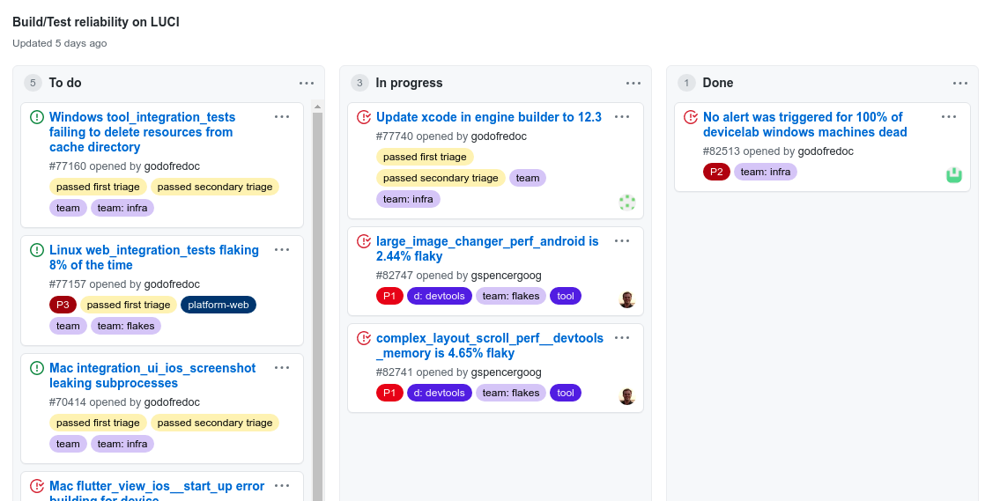
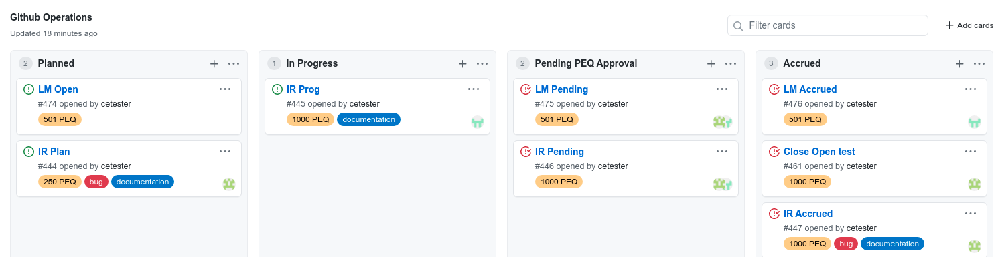
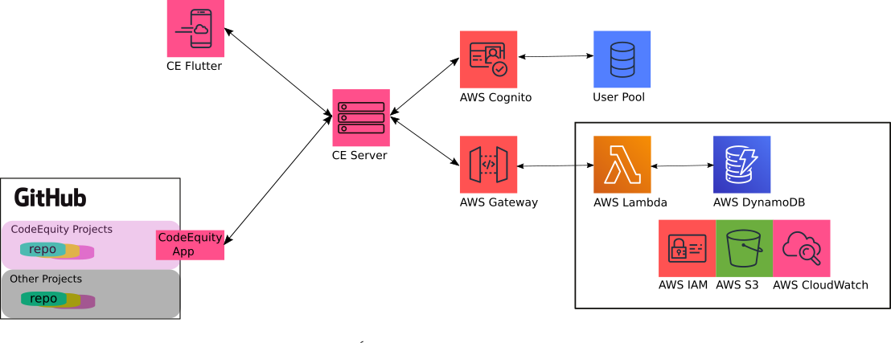

# CodeEquity Manual

**DOC IN PROGRESS...**

For the developer.. XXX

For the founder.. XXX

For the collaborator.. XXX

### CodeEquity Project
XXX

### Provisional Equity (PEQ)
XXX

# CodeEquity for GitHub

CodeEquity works with GitHub through
(project boards)(https://docs.github.com/en/github/managing-your-work-on-github/managing-project-boards/about-project-boards),
which is a Kanban-style project management
tool.  GitHub's project boards are a great way to track the lifecycle of an issue during a project.
They are quick to learn, and functional enough to easily support small to medium sized projects and
teams.  GitHub has integrated their project boards with all core elements of it's repository
management toolkit, and provides a push-based notification system based on REST for external
application integration.  CodeEquity utilizes this notification system along with GitHub's Octokit
developer API to build a wrapper around any Github project board, converting it into a CodeEquity
Project.

The image below shows a typical GitHub project.  This project is for "LUCI", and is composed of three
columns and a handful of cards that are linked to issues.  One issue can be linked to multiple cards
in GitHub.  Cards and issues can exist independently of one another, however, when they are linked,
all related information is stored with the issue.  GitHub uses labels with issues to help manage the
attention of the project's collaborators.  For example, common labels deal with feature requests,
bugs, severity, and so on.  Issues contain a history of comments, can be assigned to collaborators,
they can be opened, closed, transfered and edited.  A GitHub repository can have any number of
projects associated with it.

  &nbsp;&nbsp;&nbsp;&nbsp;&nbsp;&nbsp;&nbsp;&nbsp;&nbsp;&nbsp;&nbsp;&nbsp
  

 

This next image shows a typical CodeEquity project in GitHub.  There are a handful of key
differences that can be seen here.

  &nbsp;&nbsp;&nbsp;&nbsp;&nbsp;&nbsp;&nbsp;&nbsp;&nbsp;&nbsp;&nbsp;&nbsp
  

 

CodeEquity adds two new types of labels, called PEQ (or Provisional EQuity) labels.  For example,
the *Close open test* card in the **Accrued** column has the label * **1000 PEQ** *.  This label
informs CE Server that the *Close Open test* card, or rather the issue linked to it, is valued at
1000 shares of provisional equity.  In contrast, an AllocPEQ label such as * **200,000 AllocPEQ** *
indicates that the task described in the related card has been allocated 200,000 PEQs for planning,
but has not yet been fully tasked out.  There can only be one PEQ label per issue.

CodeEquity projects also have two reserved columns: **Pending PEQ Approval** and **Accrued**.  When
a card moves to the **Pending PEQ Approval** column, it serves as a signal to CE Server that the
underlying issue is completely resolved.  When the card enters **Pending PEQ Approval**, it also
serves as a request to the whomever has approval authority on the project, to confirm that the issue
has been resolved in a satisfactory way.  The approver confirms by moving the card
into the **Accrued** column.  The act of moving a card into the
**Accrued** column is an explicit acknowledgement to the team, and to CodeEquity, that the
assignee(s) on the issue have just accrued the PEQs related to that issue.  For example, when *IR
Pending* moves to the **Accrued** column, one thousand PEQs will accrue and be evenly distributed to
the two assignees on the issue.

The final significant difference between a normal GitHub project, and a CodeEquity project, is that
CE Server enfoces a one to one mapping from issues to cards in a CodeEquity project.  Otherwise, if
one issue has multiple cards, there is no clean and simple way to determine how and when the
associated PEQs should accrue.  CE Server enforces this mapping by force-creating a new issue every
time a user attempts to add an issue to a second project column.

There are other differences as well, mainly to ensure that a CodeEquity project stays in a valid state.
These differences are smaller in scope, and are introduced below.

# CodeEquity Architecture

CodeEquity is composed of the following major components:

  &nbsp;&nbsp;&nbsp;&nbsp;&nbsp;&nbsp;&nbsp;&nbsp;&nbsp;&nbsp;&nbsp;&nbsp
  

 

* **CodeEquity GitHub App**.  A GitHub app that converts projects in a GitHub repository into CodeEquity projects.
* **CE Flutter**.  A multi-platform front end for managing CodeEquity projects.
* **CE Server**.  A Node.js Express server that handles requests from the CodeEquity GitHub App and
                  CE Flutter, and manages all related modifications to provisional equity.  
* **AWS Backend**.  A serverless backend for CE Server responsible for storing and supplying all data
                and updates related to provisional equity.

A brief review of each component follows.  Please see the CodeEquity manual for a more in-depth description.

## CodeEquity App for GitHub

The CodeEquity App for GitHub is (XXX or will be) available in the GitHub Marketplace.  The CodeEquity
App connects a user's GitHub repository to CE Server, by means of the GitHub notification system.
Once installed, any 
[project](https://docs.github.com/en/github/managing-your-work-on-github/managing-project-boards/about-project-boards)
in that repository can be transformed into a CodeEquity project.

The CodeEquity App is actually just a cohesive set of notification requests and permissions that allow
GitHub and CE Server to begin communicating.  As such, the app has no logic or state specific to it.

## CE Flutter

CE Flutter is a Flutter app for desktop and mobile devices that is used to manage CodeEquity
projects.  CE Flutter communicates directly with the AWS backend for provenance related to
provisional equity, collaborator agreements, equity agreements and more. 

## CE Server

CE Server is a Node.js Express server.  CE Server has two primary functions for CodeEquity projects
in a GitHub repository.  First, it records all interactions with provisional equity-related issues,
cards, columns and labels in order to fully track the provenance of all related provisional equity.
Second, CE Server makes changes on behalf of a user in the CodeEquity project in GitHub to ensure
the project remains in a valid state.  CE Server does also manage a small amount of state, which
helps provide a significant speedup to it's GitHub operations.

## AWS Backend
The AWS backend is a serverless architecture on AWS. The architecture is specified with a [yaml
file](ops/aws/samInfrastructure.yaml) that is a mixture of AWS's SAM and CloudFormation
specifications.

Requests from CE Server and CE Flutter are signed with JWT tokens secured from AWS Cognito running
with a user pool.  Signed requests are sent to AWS Lambda functions via AWS Gateway.
[awsDynamo](ops/aws/lambdaHandlers/awsDynamo.js) contains the key lambda handlers for the backend.
Their primary function is saving and retrieving data from a collection of AWS DynamoDB tables.

All communication with the AWS Backend is encoded as JSON REST data.

# CodeEquity QuickStart

## Developer
## Founder
## Collaborator

