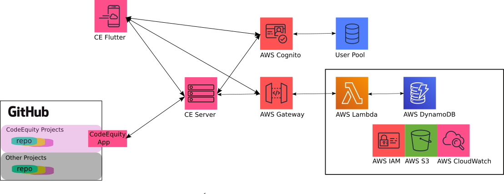

<br>
**DOC IN PROGRESS...**
<br>
**DOC IN PROGRESS...**
<br>
**DOC IN PROGRESS...**

# CodeEquity Software Manual

CodeEquity is based on a simple truth: ***If you help create something, you should
be among those that benefit from it***.

Traditional established companies pay employee salaries, promise stability, and provide many perks
including insurance, retirement plans, office space, computing environments, lots of free coffee and
more.  In return, those companies own all of the output of every one of their employees.  Startup
companies are similar, but in place of stability, retirement plans, and competitive wages,
they offer small amounts of equity in order to attract skilled employees.

There are other models for organizing teams to create products.  GitHub provides a space for the
primary alternative today in the software development world.  Most new ventures in the GitHub space do not
offer money or equity to compensate skilled contributors.  Nor do they offer office space, insurance,
retirement plans, or lots of free coffee.  Instead, they offer social recognition and a sense of
purpose.  These incentives can be powerful, but only up to a point. 

CodeEquity proposes that these new ventures additionally offer up their primary currency,
***ownership***, as the key incentive to attract skilled contributors.  CodeEquity is both a legal
framework, and a software framework, that makes this simple idea easy to put into practice, and
iron-clad should the venture become successful down the road.

In the big picture, CodeEquity is an attack on the greatest remaining barrier to large scale
technical innovation: the human factor.  Up until now, the necessary ingredients for a
venture to take off have been: lots of money to pay for wages, stuff and services; some luck; and a good
idea.  Some luck and a good idea will always be necessary components for success, but startup money?
The underlying equation has changed over the last decade, with the advent of dependable internet, and
cloud-based compute services, code and project management.  We no longer need most of the trappings
of a traditional company. What's left is the human factor: How
do you attract several person-years of skilled, dedicated help without the money to pay wages?
Fully sharing equity is the only answer that has a chance to reshape or destroy this final 
blocker to full merit-based technical innovation.

How much more dynamic, inventive and sizeable would the GitHub community be if contributors saw the
potential, however slight, of making a living or better by contributing to a project?

For the *potential contributor* the choice is clear.  All else being equal between two projects of
equal merit, one of which is a CodeEquity project, and one which is not, why contribute to the
project that does not share equity?

For the *founders*, the choice is easy as well.  Most new ventures find it hard to attract skilled
contributors.  Is there a more powerful way to attract them than by offering equity?  Yes, it will
reduce the equity you can retain personally, but the equity you do retain has a much higher chance
of being worth something down the road if you can get good help early on.

For the potential contributor to CodeEquity software itself, well, yes, we are a CodeEquity project,
so consider joining the team!

The remainder of this document focuses on the software infrastructure, exclusively.


## CodeEquity Key Concepts

Equity in a CodeEquity project is earned by making contributions to that project.  In a typical
company, equity is granted once a year to a person privately based on the subjective
evaluation of that person's boss.  In contrast, equity in a CodeEquity project can be earned at any point during
the year.  The equity value of any contribution is known to all, up front, and the accrual of equity
is both objective and public.

Several common CodeEquity terms and concepts are introduced below, primarily to help make
the manual concise and understandable.  These introductions are for common reference only.  For
binding definitions and details, refer to the **CodeEquity Venture Equity Agreement**.


### CodeEquity Ventures & Projects

A CodeEquity Venture is analogous to a company.  A CodeEquity Project is analogous to a project, or
part of a project within a company.

For example, Jessie has a great idea for an app that allows people within a community to browse,
borrow and loan books with each-other, and has decided to pursue this idea within the CodeEquity
framework.  Jessie is calling the app "BookShare".  To simplify planning, Jessie decides to break the app
development, planning and tracking into several projects: *BookShare frontend*, *BookShare backend*, and *BookShare
operations*.  In this example, the CodeEquity Venture is BookShare.  The Venture is made up of three
CodeEquity Projects: *BookShare frontend*, *BookShare backend*, and *BookShare operations*.
CodeEquity will track and collate provisional equity across the three projects and report it within
the umbrella of the Venture: BookShare.


### Provisional Equity (PEQ)

In point of fact, *equity* is not earned in CodeEquity Ventures, but rather *provisional equity* is.
Equity in a company requires the company to exist as a legal entity such as an LLC or a Corporation.
This is not a useful step for most early ventures, since it takes time and money to set up, time
that is better spent on developing and testing the ideas for the venture.

Provisional equity are normal stock options, provisional on the venture being converted into a legal
business entity at some point in the future.  The CodeEquity promise, secured by the CodeEquity legal framework, is that every
share of provisional equity owned by a contributor will be converted 1:1 to a stock option in any
company created from the venture.  Furthermore, any revenue gained by a CodeEquity Venture (for
example, with the sale of related intellectual property) that is not fed back into the venture will
be split among contributors according to how many shares of Provisional Equity they have.

For binding definitions and details, refer to **Provisional Stock Options** in the **CodeEquity Venture Equity Agreement**.  
For simplicity of reference throughout CodeEquity, one provisional stock option is denoted as *1 PEQ*,
or *one share of provisional equity*.


### PEQ Issues

A CodeEquity Project will normally be planned and tracked with a collection of *issues* managed 
with project management software, such as GitHub project boards.  Common issues
involve planned features, feature requests, and bug reports.

A PEQ issue is any issue that has a PEQ value attached to it.  For example, the *BookShare frontend*
project might have an issue: "Add book detail page".  Without an associated PEQ value, this is not a
PEQ issue.  Once Jessie adds, say, a "1000 PEQ" label to the issue, it becomes a PEQ issue and will
be subsequently tracked by CodeEquity software.


### CodeEquity Software Framework Mandate

All elements of CodeEquity's software exist to aid in tracking and managing the provisional equity
associated with a CodeEquity Venture.  This responsibility lasts up until when the Venture converts
to a legal corporate entity and the provisional shares are converted to stock options in that new
entity, at which point the new legal entity takes over.

To support this mandate, CodeEquity software tracks and stores every action that impacts the
resolution of every PEQ issue.  Likewise, CodeEquity is free to ignore actions that
have no impact on the resolution of non-PEQ issues.  For example, CodeEquity tracks
operations like adding a PEQ label to an issue, closing a PEQ issue, or changing who is assigned to
a PEQ issue.  For example, CodeEquity ignores operations like creating an issue that does not have a
PEQ label, adding a comment to an issue, or changing the name of a project column that does not have
associated PEQ issues.

CodeEquity ensures that once PEQs have accrued (i.e. provisional equity has
been earned by a contributor), all characteristics of those PEQs are immutable.  For example, if
Alex earned 1000 PEQs for implementing a new feature for BookShare, they can not be taken away or
changed down the road.


# CodeEquity for GitHub

CodeEquity works with GitHub through
[project boards](https://docs.github.com/en/github/managing-your-work-on-github/managing-project-boards/about-project-boards),
which is a Kanban-style project management
tool.  GitHub's project boards are a great way to track the lifecycle of all the issues related to a
project throughout the duration of the project.
They are quick to learn, and functional enough to easily support small to medium-sized projects and
teams.  GitHub has integrated their project boards with all core elements of its repository
management toolkit, and provides a push-based notification system for external
application integration.  CodeEquity utilizes this notification system along with GitHub's Octokit
REST and GraphQL APIs to build a wrapper around any Github project board, converting it into a CodeEquity
Project.

The image below shows a typical GitHub project.  This project is for "LUCI", and is composed of three
columns and a handful of cards that are linked to issues.  One issue can be linked to multiple cards
in GitHub.  Cards and issues can exist independently of one another, however, when they are linked,
all related information is stored with the issue.  GitHub uses labels with issues to help manage the
attention of the project's collaborators.  For example, common labels deal with feature requests,
bugs, severity, and so on.  Issues contain a history of comments, can be assigned to collaborators,
they can be opened, closed, transfered and edited.  A GitHub repository can have any number of
projects associated with it.


<p float="left">
  
</p>

<br>

This next image shows a typical CodeEquity project in GitHub.  There are a handful of key
differences that can be seen here.


<p float="left">
  
</p>

<br>

CodeEquity adds two new types of labels, called PEQ (remember, Provisional EQuity) and AllocPEQ labels.  For example,
the *Close open test* card in the **Accrued** column has the label ***1000 PEQ***.  This label
informs CE Server that the *Close Open test* card, or rather the issue linked to it, is valued at
1000 shares of provisional equity.  In contrast, an AllocPEQ label such as ***200,000 AllocPEQ***
indicates that the task described in the related card has been allocated 200,000 PEQs for planning,
but has not yet been fully tasked out.  There can only be one PEQ or AllocPeq label per issue.

CodeEquity projects also have two reserved columns: **Pending PEQ Approval** and **Accrued**.  When
a card moves to the **Pending PEQ Approval** column, it serves as a signal to CE Server that the
underlying issue is completely resolved.  It also
serves as a request to whomever has approval authority on the project, to confirm that the issue
has been resolved in a satisfactory way.  The approver confirms by moving the card
into the **Accrued** column.  The act of moving a card into the
**Accrued** column is an explicit acknowledgement to the team, and to CodeEquity, that the
assignee(s) on the issue have just accrued the PEQs related to that issue.  For example, when *IR
Pending* moves to the **Accrued** column, one thousand PEQs will accrue and be evenly distributed to
the two assignees on the issue.

The final significant difference between a normal GitHub project, and a CodeEquity project, is that
CE Server enforces a 1:1 mapping from issues to cards in a CodeEquity project.  Otherwise, if
one issue has multiple cards, there is no clean way to determine how and when the
associated PEQs should accrue.  CE Server enforces this mapping by force-duplicating the issue
every time a user attempts to add an issue to a second project column.

There are other differences as well, mainly to ensure that a CodeEquity project stays in a valid state.
These differences are smaller in scope, and are introduced below.  


# Common Lifecycle Examples

The initial signup and startup for every CodeEquity project is identical.

The first step is to install the CodeEquity App for GitHub, following the instructions [here](#codeequity-app-for-github).
The default installation enables all of the repositories you own to
host CodeEquity projects, but will not impact those repositories that never do.

Next, browse to www.codeequity.net, and sign up for CodeEquity.  Part of this process
involves reading and signing the equity agreement that all contributors to your venture
will sign, ensuring their fair share of provisional equity.

The third and final step in the early thinking for any CodeEquity project is, well, thinking about the
equity.  *How much total (provisional) equity will there be in the venture?*  *How much should each
task be worth?*  The CodeEquity website proposes a default starting point for any software venture.
(XXX revisit XXX)  See [common equity structures](docs/adoc.md) for the rationale and 
details on this default setup.  There are a few important points to keep in mind here:
   1. No decision at this point is permanent.  In fact, you should expect overall PEQs and PEQs per
task to change over time.  

   2. The total number of allocated PEQs doesn't matter.  What matters is the percentage of
PEQs a person has accrued compared the overall total accrued in the venture, when it comes
time to convert PEQs into equity in a legal entity.  That percentage will develop over months and years, not days.

So, your early choices here **are useful to start communications with contributors**, but beyond that,
they are **neither major nor permanent**.

The default equity structure authorizes 7 - 10 million shares of provisional equity (stock) up front for
software development, which is 30-50% of the overall provisional equity in the venture.  The default
plan assumes three person-years of work for a typical software venture to get the code in place to
make a run for it.  This works out to be, roughly:
   * 1,000 PEQs for tiny tasks, of maybe an hour or so,
   * 10,000 PEQs for one person-day of work,
   * 50,000 PEQs for one person-week of work.  

### Creating a CodeEquity Project Structure from Scratch

A CodeEquity project can be converted from an existing GitHub project board, or created from
scratch.  This first example follows Connie creating a CodeEquity Project as a completely new
project.  Connie is already a contributor to several repositories owned by other people, and is the
owner of several others.  Connie is planning to start exploring a brewery
simulation game as a CodeEquity Project.  Connie has already created the GarlicBeer public
repository, and has a few files there but has not yet started a project board.

Connie starts by [signing up](#common-lifecycle-examples) for CodeEquity, following the default
installation for public repositories.  Connie also sticks with the default equity structure proposed
by the CodeEquity website, comfortable that as the project evolves, so can the equity structure for
GarlicBeer.  (XXX REVISIT XXX) should I need to select empty projects as codeequity projects?  No.


#### GarlicBeer Project Structure

A CodeEquity project supports any type of flat project board setup that can be made in GitHub.  Once
you start creating and manipulating PEQ issues in your project board, CE Server will create the two
reserved columns **Pending PEQ Approval** and **Accrued** as needed.  CodeEquity projects also
support a hierarchical project structure, which can make organization and reporting more cohesive.

The GarlicBeer repo so far has no issues, and no project boards.  Connie decides to adopt 
CodeEquity's recommended hierarchical layout as a starting point.  In this approach, a user creates
several CodeEquity projects within the repo, all of which are linked together.  The top level
project is named `Master` (see [config.js](webServer/config.js) to modify names) by default.  The
child projects are named after the cards in the columns of the `Master` project.  In CE Flutter,
PEQs for contributors and the overall venture can be 
grouped and summarized by columns in the `Master` project.

Connie creates one column in `Master` for `Software Contributions`, one for `Business
Operations`, and a third for `Unallocated`.  The `Unallocated` column is a handy way to inform
CodeEquity that all unallocated equity should be summarized as a sibling of the software and bus-ops
columns.  

<p float="left">
  
</p>

In the **Software Contributions** column for `Master`, Connie decides to start with very broad
categories, each of which will be a project in its own right: *FrontEnd*, *BackEnd* and another
*Unallocated* card that serves as a placeholder for provisional equity for other work down
the road.  Unallocated cards in `Master` should not be matched with a related project.

Connie takes advantage of a shorthand built into CodeEquity projects.  When creating cards, CE
Server looks for any line of the form `<allocation, PEQ: 1,000,000>`, or `<PEQ: 1000>` (any number
works).  When found, CE Server will create an issue for that card, rebuild the card to point at
the new issue, and send the PEQ data to the AWS Backend.  This is a very quick way to build a set of
allocations and issues for your new project.

In this case, Connie types: 

<p float="left">
  
</p>

which results in: 

<p float="left">
  
</p>

If you are familar with GitHub, you will notice that the result is a card linked to an open issue with
the name `Back End`, and a label of `2000000 AllocPEQ`.  Using CodeEquity's default suggestion of
`50,000 PEQ` for one person-day of work, this means Connie has made a rough allocation of 10
person-months of work for the back end.  If this turns out to be wrong later (which is almost a
certainty), that allocation can be adjusted in either direction with no bad consequences.

Connie adds a few more high-level allocations in `Master`, resulting in: 

<p float="left">
  
</p>

At this point, Connie is done with high level allocations.  Connie's rough estimate is 
that both the front end and the back end will need 2 million PEQs to complete, and has added a
buffer of another 2 million PEQs for whatever comes up under **Software Contributions**.  Similarly,
Connie has estimated a million PEQs for **Business Operations**.

The `Master` project is now done for now, the child projects are next.  There are two additional projects to
create, one for each card in `Master` that is not an *Unallocated* card, namely *Front End* and
*Back End*.  While not a requirement, CodeEquity recommends choosing columns in these child projects that support the natural
flow of an issue in a CodeEquity project: planned, in progress, pending PEQ approval, and accrued
(or approved).  Connie decides to proceed with this recommendation, ending up with the following
projects:

<p float="left">
  
</p>

and the following column layout in each child project:

<p float="left">
  
</p>


#### Basic Issue Lifecycle

Connie wants a hands-on understanding of what happens with a PEQ issue as it works its way through
the project.  Connie starts with entering the following PEQ issue using the shortcut identifier
`<PEQ: 1000>`: 

<p float="left">
  
</p>

resulting in: 

<p float="left">
  
</p>

Looking at the current issues tab, you can see that all the PEQ-related cards have had corresponding
issues created:

<p float="left">
  
</p>

Clicking into the *Test PEQ LifeCycle* issue, Connie adds an assignee, then back in the projects
page, Connie drags and drops the card into the **In Progress** column.
Connie goes back and forth playing with this a few times before leaving the card in **In
Progress**.   If Connie were to try dragging the card into the
**Accrued** column right now, CE Server would move the card back to **In Progress**.  PEQ issues
can only enter **Accrued** from the **Pending PEQ Approval** column.

<p float="left">
  
</p>

<p float="left">
  
</p>

Now Connie clicks back into the issue, and clicks `Close issue`	in GitHub.  CE Server sees this
notification and automatically moves the card into the **Pending PEQ Approval** column.
Alternatively, Connie could have dragged the card from **In Progress** to **Pending PEQ Approval**,
and CE Server would have automatically closed the issue.  Connie
clicks back into projects to verify this: 

<p float="left">
  
</p>

Connie then clicks `Reopen issue` and `Close issue` a few times to see how the card moves, leaving
the card in the **Pending PEQ Approval** column.  Finally, Connie clicks into the `Front End`
project again, and drags the card into the **Accrued** column:

<p float="left">
  
</p>

Note that the history of these actions has been caught by GitHub, including which individual
caused the actions to occur.  For example, the first red circle shows `connieCE closed
this` which reflects the fact that Connie closed the issue.  The action immediately following is
`codeEquity (bot) moved this`, reflecting the fact that CE Server moved the card to the **Pending
PEQ Approval** column as a result of Connie closing the issue.

<p float="left">
  
</p>

#### CE Flutter results

Done with GitHub for the moment, Connie opens the CE Flutter app to see what has happened: (XXX REVISIT XXX).


### Converting a Project into a CodeEquity Project

Jessie ran across CodeEquity on the GitHub Marketplace, and is excited to try it out in hopes of
attracting more developers.  Jessie has decided to convert the BookShare FrontEnd (or BookShareFE)
project into a CodeEquity project.  The BookShareFE project is part of the BookShare repository in
GitHub, and both the repo and the project have been in active use for over a year now.

Jessie starts by installing the CodeEquity App for GitHub, following the instructions in the CE
Server portion of this manual.  (XXX REVISIT.  Use actual bookshare project XXX) Jessie then browses to www.codeequity.net, and signs up for
CodeEquity.  Part of this process involves reading and signing the equity agreement that all
contributors to the BookShareFE project will sign, ensuring their fair share of provisional equity
in this new venture.

While at CodeEquity.net, Jessie selects the `Convert BookShareFE` option.  At this point, the
CodeEquity website instructs the server to convert the BookShareFE project into a CodeEquity
Project. CE Server will initialize internal state (see the
**Linkages** Section below), and enforce the 1:1 mapping rule between issues and cards in the new
CodeEquity project by duplicating and renaming any issue that is pointed at by more than one card.
The new issue names are identical to the original name, but with a random alpha-numeric string
appended to the end of it.

BookShareFE is now a valid CodeEquity project.  All pre-existing columns are preserved, as
well as all pre-existing cards, issues and labels.  The reserved columns **Pending PEQ Approval**
and **Accrued** will be added as soon as a PEQ issue is closed.  The reserved PEQ and AllocPeq
labels will be added as soon as a PEQ issue, or an allocation are added to the new project.  From
this point on, all changes to BookShareFE maintain it's valid status as a CodeEquity Project.

Jessie's BookShareFE project looks identical to how it looked before being converted
into a CodeEquity project:

<p float="left">
  
</p>

While BookShareFE is a valid CodeEquity project, it does not have a single PEQ issue, there is no
provisional equity, and as such it is a CodeEquity project in name only.  Jessie wants 
to make substantive use of CodeEquity, and so carries out the next several steps:
   * *Columns:*  Adds the column **Planning** (*optional*).  Renames the default **In Progress**
column to **Underway** in the CodeEquity website (*optional*).

   * *PEQ labels:* Adds a handful of PEQ labels.  Typically, this step is unnecessary, as the CE
Server will add PEQ labels to GitHub automatically when a need is detected.  To do this, in GitHub
click on `Issues`, then `Labels`, then `New Label`.  Type in a PEQ label name, like `1000 PEQ` and
click on `save`.  CE Server will rebuild this into a valid PEQ label, although you may need to
refresh your screen in order to see any change.  See the CE Flutter manual for PEQ label options.

   * *AllocPEQ issues:* Adds several large AllocPEQ cards.  AllocPEQ cards are a way to indicate
an estimated value of a large chunk of work that is currently not scoped out.  For example, the
*Expand Flutter Testing* card with **AllocPEQ 500,000** indicates a large chunk of untasked work
under the general category of expanded flutter testing.

   * *Update issues:* Adds assignees and PEQ labels to the existing issues.  Adds a few extra labels
to help identify which page of the front end the issue belongs to.  In order to help keep the
initial conversion as simple as possible, no cards will move with the addition of a PEQ label.  So if an issue had been closed earlier, and there are
assignees, and a PEQ label is added, CE Server will NOT move that related card into the **Pending PEQ
Approval** column.  Contributors should move these by hand.

   * *Move closed PEQ issues:* Moves all closed PEQ issues with assignees to the **Pending PEQ
      Approval** column.

At the end of this, the project looks like this:

<p float="left">
  
</p>


initial equity structure.
comment on underway.
Accr col.


### Working with PEQ Issues


# CodeEquity Architecture Overview

CodeEquity is composed of the following major components:

<p float="left">
  
</p>

<br>


* **CodeEquity GitHub App**.  A GitHub app that converts projects in a GitHub repository into CodeEquity projects.
* **CE Flutter**.  A multi-platform front end for managing CodeEquity projects.
* **CE Server**.  A Node.js Express server that handles requests from the CodeEquity GitHub App and
                  CE Flutter, and manages all related modifications to provisional equity.  
* **AWS Backend**.  A serverless backend for CE Server responsible for storing and supplying all data
                and updates related to provisional equity.

### Overview: CodeEquity App for GitHub

The CodeEquity App for GitHub is (XXX or will be) available in the GitHub Marketplace.  The CodeEquity
App connects a user's GitHub repository to CE Server, by means of the GitHub notification system.
Once installed, any 
[project](https://docs.github.com/en/github/managing-your-work-on-github/managing-project-boards/about-project-boards)
in that repository can be transformed into a CodeEquity project.

The CodeEquity App is actually just a cohesive set of notification requests and permissions that allow
GitHub and CE Server to begin communicating.  As such, the app has no logic or state specific to it.


### Overview: CE Flutter

CE Flutter is a Flutter app for desktop and mobile devices that is used to manage CodeEquity
projects.  CE Flutter communicates directly with the AWS backend for provenance related to
provisional equity, collaborator agreements, equity agreements and more. 


### Overview: CE Server

CE Server is a Node.js Express server.  CE Server has two primary functions for CodeEquity projects
in a GitHub repository.  First, it records all interactions with provisional equity-related issues,
cards, columns and labels in order to fully track the provenance of all related provisional equity.
Second, CE Server makes changes on behalf of a user in the CodeEquity project in GitHub to ensure
the project remains in a valid state.  CE Server does also manage a small amount of state, which
helps provide a significant speedup to it's GitHub operations.

### Overview: AWS Backend
The AWS backend is a serverless architecture on AWS. The architecture is specified with a [yaml
file](ops/aws/samInfrastructure.yaml) that is a mixture of AWS's SAM and CloudFormation
specifications.

Requests from CE Server and CE Flutter are signed with JWT tokens secured from AWS Cognito running
with a user pool.  Signed requests are sent to AWS Lambda functions via AWS Gateway.
[awsDynamo](ops/aws/lambdaHandlers/awsDynamo.js) contains the key lambda handlers for the backend.
Their primary function is saving and retrieving data from a collection of AWS DynamoDB tables.

All communication with the AWS Backend is encoded as JSON REST data.

# CodeEquity App for GitHub

The CodeEquity App for GitHub can either be found in the GitHub Marketplace, or by browsing directly
to https://github.com/apps/codeEquity.  Installing the app will allow the GitHub repository owner to
convert any GitHub project board into a CodeEquity Project, or to start a new CodeEquity Project
from scratch.

The CodeEquity App for GitHub should be installed by the GitHub repository owner, only.
Contributors to a project do not need to install this app. 

To install:
 * browse to https://github.com/apps/codeEquity, click 'install', and accept defaults.

If you are installing CodeEquity for a private repository, you will need to provide a personal
access token.  To create a personal access token for CodeEquity,
 * browse to https://github.com/settings/tokens, click "create a new token.
 * add a note, like "for CodeEquity" at the top
 * set the scope to be "repo  full control of private repositories"
 * click generate at the bottom
 * use CE Flutter to save this token.

There is very little to this app, as mentioned in the overview it is a cohesive set of
notification and permissions, along with the address of CE Server so that GitHub knows where to send
the notifications to.  The notifications are JSON REST, see a full example of one below.

# CE Server

CE Server is a Node.js Express server.  GitHub sends notifications to CE Server whenever a change is
made to a CodeEquity Project, as directed by the CodeEquity App for GitHub.  The express
specification is found in [ceServer.js](ceServer.js), which establishes
[githubRouter.js](routes/githubRouter.js) as the central dispatcher for CE Server.

The main notification types in GitHub include: `issue`, `project_card`, `project`, `project_column`,
and `label`.  There are others types, for example `synchronize` or `repository`, but these are
irrelevant to CodeEquity.  The payloads for each notification type vary (details can be found [here](https://docs.github.com/en/developers/webhooks-and-events/webhooks/webhook-events-and-payloads#issues), but most carry information like action, repo, issue, timestamp and so on.  A simplified example
of a `labeled` action for an `issue` notification is shown below.

```
{ action: 'labeled',
  issue: 
   { url: 'https://api.github.com/repos/codeequity/codeEquity/issues/57',
     repository_url: 'https://api.github.com/repos/codeequity/codeEquity',
     number: 57,
     title: 'simple',
     user: 
      { login: 'rmusick2000',
        url: 'https://api.github.com/users/rmusick2000' },
     labels: [ [Object] ],
     state: 'open',
     created_at: '2020-07-12T20:38:39Z',
     updated_at: '2020-07-12T20:38:39Z' },
  label: 
   { url: 'https://api.github.com/repos/codeequity/codeEquity/labels/500%20PEQ',
     name: '500 PEQ',
     color: 'ffcc80',
     default: false,
     description: 'PEQ value: 500' },
  repository: 
   { name: 'codeEquity',
     owner: 
      { login: 'codeequity' },
     html_url: 'https://github.com/codeequity/codeEquity',
     default_branch: 'master' },
  sender: 
   { login: 'rmusick2000' }}
```

## `githubRouter` Job Dispatch
At the time of writing, CE Server is singly-threaded with no thread pool or worker threads.

### `ceJobs`
In a well-behaved world, the handler in `githubRouter` would simply reroute each notification to
it's specific handler, for example, `githubIssueHandler` for the `issue:labeled` notification above.  As is typically the
case for servers in the wild, however, that doesn't work here.

The most common way in which this fails is when a group of notifications arrive at CE Server in
close proximity (by time).  By default, each time a new notification arrives, it acts as an
interrupt, delaying whichever notification was already being handled.  Over time, the currently
pending operations interleave in the server in unpredictable ways.  This has several impacts,
including difficult debugging, out of order execution (vs. the originating actions in GitHub)
becoming the norm, and job starvation.

CE Server handles this with a FIFO (first in first out) queue in `githubRouter` called `ceJobs`.
Every notification that arrives interrupts `githubRouter` long enough to add the job details to
`ceJobs`, then processing continues with the first job on the queue.  In this manner, actual server
operations begin and end with a single notification before starting on the next notification, and
job starvation is not an issue.  

### Demotion
The `ceJobs` queue ensures that each notification is treated by CE Server as one atomic unit, in other
words, no other notification can interfere with it during processing.  The `ceJobs` queue does not address
out of order operations, however, which can lead to uncommon but pernicious failures due to
dependency issues.

Many operations in GitHub generate several component notifications.  For example, creating an issue
can generate an `issue:open` notification, several `issue:assigned` notifications, several
`issue:labeled` notifications and more.  The notifications are all sent at roughly the same time,
and can arrive at CE Server out of order.  There is no sequencing or grouping information in the
notifications, and the timestamps are not dependable (for example, stamps only record to the second,
and different stamps for the same operation can vary by as much as 10s!).

To manage this, if a subhandler of `githubRouter` detects a dependency issue, it will direct the
`githubRouter` to demote the current job by pushing it further down the `ceJobs` queue, so that the job it
depends on can be handled first.

##### Example

Jessie is creating a new issue in BookShareFE, called *Blast 1*.   Jessie has filled out the issue
details, including who is assigned to it, and has given the issue a PEQ label.  As soon Jessie
clicks `Submit new issue` in GitHub, GitHub sends `githubRouter` a slew of notifications.  At some point
during processing, the `ceJobs` queue looks like this: 

```
ceJobs, Depth 2 Max depth 11 Count: 236 Demotions: 1
    jessie BookShareFE yPqzTssMts issue assigned Blast 1 1622310313268 0
    jessie BookShareFE NRwxaJRGlv issue labeled Blast 1 1622310313440 0
```

The handler treats assignments differently depending on if the issue is a PEQ issue, or not.  At
this point in time, we can tell from the information in the notification that *Blast 1* is a PEQ
issue, but CE Server won't have pushed this information up to the AWS backend until the second item
`issue:labeled` in the queue is processed.

The  `issue:assigned` job will be popped off `ceJobs` first, and sent to the issue handler.  During processing,
the handler notices that dependencies are incorrect, and requests the job be demoted

```
<issue: assigned Blast 1>  start yPqzTssMts
<issue: assigned Blast 1>  assigned jessie to issue 906524064
<issue: assigned Blast 1>  Get PEQ from issueId: 906524064

Assignment to peq issue, but peq doesn't exist (yet).  Reshuffle.
<issue: assigned Blast 1>  Delaying this job.
Demoting yPqzTssMts 1
```

After the demotion, `ceJobs` shows that the assignment job as been pushed further down on the stack.

```
ceJobs, after demotion Depth 2 Max depth 11 Count: 236 Demotions: 2
    jessie BookShareFE NRwxaJRGlv issue labeled Blast 1 1622310313440 0
    jessie BookShareFE yPqzTssMts issue assigned Blast 1 1622310313477 1
```

Demotions are based on the arrival timestamp (the big number in the example above) of the
notification.  Early demotions will drop at least two jobs down, but no more than a few hundred
milliseconds.  If a job continues being demoted, the minimum time delay grows.  If a job has been demoted more
than a set number of times (default is 30), the server will drop it with an error, and move on the
the next job.  The values controlling this operation can be configured in
[config.js](webServer/config.js).


## Linkages

CE Server's subhandlers interact with GitHub via Octokit, and with the AWS Backend.  These APIs
frequently require information related to the operation at hand that can not be found in the
notification.  For example, closing a PEQ issue in GitHub will cause CE Server to move that issue
into the **Pending PEQ Approval** column.  The move requires the project ID and column ID of the
target column, neither of which are to be found in the `issue:closed` notification.  

Requesting this information on the fly from GitHub more than doubles the request volume and the
subsequent await times, leading to a noticeable lag for the GitHub user.  To avoid this, CE Server
tracks two pieces of state.  The first is the `ghLinks` table shown below, which gathers the most
frequently required names and ids surrounding an issue.

```
IssueId IssueNum CardId  Title                               ColId      ColName              ProjId     ProjName        SourceCol 
906523785 559 62095884   Github Operations                   14524013   Software Contributio 12566158   Master          14524013  
906523791 560 62095889   Unallocated                         14524013   Software Contributio 12566158   Master          14524013  
906523793 561 62095893   Unallocated                         14524014   Business Operations  12566158   Master          14524014  
906523901 562 62095914   Snow melt                           14524020   Accrued              12566159   Data Security   -1        
906524003 563 62095929   Ice skating                         14524020   Accrued              12566159   Data Security   -1        
```

The second is a `ghLocs` table shown below, which tracks the ids and names of the projects and
columns in each CodeEquity Project.  
```
Repo                 ProjId     ProjName        ColId      ColName             
ariCETester/CodeEqui 12566158   Master          14524013   Software Contributio
ariCETester/CodeEqui 12566158   Master          14524014   Business Operations 
ariCETester/CodeEqui 12566158   Master          14524015   Unallocated         
ariCETester/CodeEqui 12566159   Data Security   14524016   Planned             
ariCETester/CodeEqui 12566159   Data Security   14524017   In Progress         
ariCETester/CodeEqui 12566159   Data Security   14524019   Pending PEQ Approval
ariCETester/CodeEqui 12566159   Data Security   14524020   Accrued             
```

CE Server keeps `ghLinks` and `ghLocs` up to date with every operation on projects and columns in
GitHub, and regenerates the state from scratch should the server be restarted.  Together, this state
information is responsible for significant speedups for user operations on GitHub.

## Authorizations

CE Server uses several APIs to communicate with GitHub and the AWS Backend:
* The [Octokit REST API](https://octokit.github.io/rest.js) for GitHub
* The [Octokit GraphQL API](https://docs.github.com/en/graphql/reference) for GitHub
* An [AWS Lambda Gateway](https://docs.aws.amazon.com/lambda/index.html) for CodeEquity's AWS Backend

Each of these requires a different form of authorization.

##### CodeEquity App for Github credentials  (enabled upon app install)

When the CodeEquity App for GitHub was built, a set of private key credentials were created and
associated with the app identifier.  Every time you install the CodeEquity App for GitHub for a new repo,
GitHub internally authorizes the app (via the private key credentials) to interact with the repo.

These credentials are stored in `ops/github/auth`, and used by CE Server to acquire the Octokit
credentials described below.  Additionally, CE Flutter will on occasion
communicate directly with GitHub through Octokit.  To make this feasible, the app credentials are
also copied into the CE Flutter space as part of the flutter build step.

Note that CodeEquity has a separate testing app for GitHub, called "ceTester", described in the
**Testing** Section below.  ceTester generates GitHub activity under a separate testing account
through the GitHub Octokit API, and so requires it's own set of app credentials.  These are stored
as siblings to the credentials for the main CodeEquity App for GitHub.

##### Installation client for Octokit (refreshed hourly by CE Server)

GitHub's Octokit REST API requires an installation access token for all requests on a GitHub
repo.  CE Server acquires this token by using the private key credentials of the app making the
request, in other words, the CodeEquity App for GitHub credentials (or the ceTester credentials) described above.

In slightly more detail, the server first gets a signed JSON web token (JWT) from Octokit that is
specific to the CodeEquity App for GitHub, then uses that to get an installation-specific token
which is used to sign all subsequent requests to the REST API from the app, for the
repo-specific installation.

At the time of writing, the installation token expires after an hour or so.  `githubRouter` tracks
the age of each token for every known owner and repo, and will refresh the token when the next
notification arrives that requires communication with GitHub.

The installation token is not stored in the system.

##### Personal Access Token for GitHub (supplied by repo owner using CE Flutter)

The REST API is useful up to a point for a GitHub app, but comes with some serious limitations.  For
example, you can not delete an issue by using the REST API, which is critical for automated testing.
For example, cards in a GitHub project point to issues, so it is very easy to find an issue given a
card.  However, there are no reverse pointers.. if you only have an issue ID, you would need to ask
GitHub for all projects for the repo, then all columns per project, all cards per column, then
search all those cards for the desired issue.  This clearly does not scale.

GitHub's Octokit also provides a GraphQL API, which allows an app to traverse the object hierarchy
internal to GitHub within the context of a single query to the system.  In the example above,
finding a card from an issue is a single, simple GraphQL query, in contrast to the hundreds of
queries the REST API might require.  The GraphQL API is fast and scalable, but does require access
to a usable personal access token. 

CodeEquity's personal access token is stored along with other server authorization data in
`ops/github/auth`.  CE Server will use this token by default for all server-related GitHub GraphQL
requests.  *This token works for all public repositories the have installed the CodeEquity App for
GitHub.*

If you want to create a CodeEquity project in a *private* repository, then you will need to supply your
personal access token to CE Server via CE Flutter (instructions will follow).  Private repositories
restrict access to outsiders, so CodeEquity's personal access token will not be authorized to
operate on your repo.  Your personal access token will be stored on the AWS Backend, and only used
for CodeEquity-related operations.  If you want to avoid this, consider making your repo public, or
alternatively, transfer repo ownership to a different GitHub account from which sharing the personal
access token with CodeEquity would be more acceptable.

Note that CE Server testing is carried out with two other testing accounts, to allow for a full
collection of cross-repo and multi-user tests.  These accounts also store their personal access
tokens in `ops/github/auth` as siblings to CodeEquity's token.

##### Cognito ID token for AWS (enabled upon app install)

CE Server communicates to the AWS Backend through CodeEquity's AWS Lambda Gateway.  Authorization
for this communication is done using AWS Cognito, with a user pool.  CE Server has a built-in
Cognito account that it uses for all communication to the backend.  The credentials for this account
are stored in `ops/aws/auth`.

The Cognito ID token expires roughly every hour.  As with the management of the installation token
above, `githubRouter` tracks the age of each token for CE Server, and will refresh an
expired token when the next notification arrives that requires communication with AWS.


## Notification Filtering

The subhandlers for CE Server make changes to
CodeEquity projects in GitHub on behalf of users, in order to keep projects in a valid state.

For example, when a user closes a PEQ issue in a CodeEquity project, that indicates that the work
associated with the issue is complete, and the PEQ issue is ready to be reviewed by whomever has
approval authority on the project.  In this case, CE Server will send a request to GitHub via the
Octokit REST API to move the related card (remember, every PEQ issue has exactly one card attached
to it) into the **Pending PEQ Approval** column.  CE Server will also make a request to GitHub to
create this column in the project if it does not already exist.

A full list of these automated actions is found in the SubHandlers section below.

GitHub sends notifications to CE Server for all actions on a CodeEquity project (as directed by the CodeEquity
App for GitHub), including those that CE Server itself initiated.  In the example above, GitHub will
generate notifications related to the user closing the PEQ issue, and notifications related to the
server moving the related card to the **Pending PEQ Approval** column.  

CE Server's subhandlers assume that every new notification from GitHub originates from a human user,
which makes it straightforward to determine what additional actions CE Server must initiate in
GitHub to maintain a valid state.  For this to work, `githubRouter` filters out and ignores all
notifications that originated from CE Server itself.  Notifications generated by CE Server have a
specific `sender:login` in the notification payload that is derived from the name of the CodeEquity
for GitHub App.  Continuing with the example above, `githubRouter` will pass along notifications
related to closing the PEQ issue to the issue subhandler, but filter and ignore the notifications
related to moving the card to the **Pending PEQ Approval** column.

CE Server's `githubRouter` also filters out all notifications from CodeEquity's two primary testing
accounts, and any notifications for actions that CE Server need not pay attention to such as
`synchronize` and `repository`.

## SubHandlers 

As noted earlier, CE Server is a Node.js Express server.  The server specification is found in
[ceServer.js](ceServer.js), which establishes [githubRouter.js](routes/githubRouter.js) as the
central dispatcher for CE Server.  All notifications arrive at `githubRouter`, and are either
filtered and ignored at that point, or converted into a job on the `ceJobs` stack.  `githubRouter`
handles one job at a time from the `ceJobs` stack, from start to finish, by sending that job to it's
related subhandler and waiting for its resolution.  

CE Server pays attention to the following notification types from GitHub: `issue`,
`project_card`, `project`, `project_column`, and `label`.  Each of these notification types has it's
own subhandler.  The payloads for each notification type vary (details can be found
[here](https://docs.github.com/en/developers/webhooks-and-events/webhooks/webhook-events-and-payloads).

CE Server additionally has a test handler, which provides access to limited internal state of the
server for unit testing.

### Issue SubHandler

The issue subhandler is found in [githubIssueHandler.js](routes/githubIssueHandler.js).  Issue
notifications cover a broad range of interactions with GitHub issues, many of which are not relevant
to CodeEquity. 

The following notification types for issues are ignored by the handler: `opened`, `pinned`, `unpinned`,
`locked`, `unlocked`, `milestoned`, and `demilstoned`.  It may be surprising to see `opened` as one of
the ignored actions.  CodeEquity does not track every issue in a CodeEquity project, just those that
are PEQ issues.  A PEQ issue can only be created with a `labeled` action.

The following notification types for issues are handled by the handler: `labeled`, `unlabeled`,
`deleted`, `closed`, `reopened`, `assigned`, `unassigned`, `edited`, and `transferred`.  
*All valid actions* in this group that do
not violate the constraints below will all *cause the handler to store the raw request body for the
action in the AWS Backend, and possibly also update (or create) the PEQ issue on the AWS Backend*.

The `labeled` and `unlabeled` actions are relevant only when the label is a PEQ or an AllocPEQ label, such as
***1000 PEQ***, or ***200,000 AllocPEQ***.   A `labeled` action with a PEQ label is one of two ways to create a PEQ
issue.  The second is to create a card with a PEQ label, which is described in the card subhandler section.

The `deleted` action ignores non-PEQ issues.  Deleting a PEQ issue will cause GitHub to send CE Server at least two notifications:
`issue:deleted` and `card:deleted`.  In most cases, the card subhandler will do all of the work.  If
the issue is a PEQ issue residing in an **Accrued** column, the issue subhandler takes over.
Accrued PEQ issues are never modified on the AWS Backend, and have a permanent, binding status in
CodeEquity.  In GitHub, however, apps can be removed and repositories deleted, even those with
accrued PEQ issues.  CodeEquity, therefore, allows deletion of accrued PEQ issues with a two-step
process.  The first delete on the GitHub site retains the PEQ issue (and card), but moves the card
to the **Accrued** column in the Unclaimed project (both of which are created by the handler if they
do not already exist).  If an accrued PEQ issue is deleted from the Unclaimed project, the issue
subhandler will delete the PEQ issue from GitHub.

The `closed` and `reopened` actions are ignored for both non-PEQ issues and AllocPEQ issues.
Closing a properly-formed PEQ issue will cause the handler to move the associated card into the **Pending PEQ
Approval** column.  Reopening a PEQ issue will cause the handler to move the associated card back to
it's originating column (if known), otherwise to the **In Progress** or **Planned** if available,
otherwise the handler will create **In Progress** column and move the card there.

The `assigned` and `unassigned` actions are ignored for both non-PEQ issues and AllocPEQ issues.  For a PEQ
issue, it is possible that the backend has not yet been updated, in which case this job will be
demoted in the `ceJobs` queue.  If the constraints below are satisfied, the handler simply updates
the backend here.

The `edited` action is only handled for PEQ issues, and only when the changes involve the issue's
title.  If the constraints below are satisfied, the handler simply updates
the backend here.

The `transferred` action is only handled for PEQ issues.  The handler does not interfere with the
transfer of accrued PEQ issues, for reasons similar to allowing deletion of accrued PEQ issues on
GitHub.  The handler will record the raw action in the AWS Backend, but as before, the accrued PEQ
issue itself will be unmodified on the backend and retain its permanent, binding status in CodeEquity.


CodeEquity project Constraints for the Issue SubHandler:

<blockquote>

##### `labeled` One PEQ label per issue
If an issue is already a PEQ issue, the new label can not be a PEQ label, otherwise which PEQ value label should take precedence?
In this case the handler will send GitHub an `issue:unlabeled` event for the new label.

##### `labeled` 1:1 mapping from issue to card
If an issue is given a PEQ label, but does not have an associated card yet, the handler will ask
GitHub to create a new card for that issue.  Since the card does not have an assigned project and
column yet in the CodeEquity project, the handler will create an **Unclaimed** project with an
**Unclaimed** column if they do not already exist, and place the card there.

##### `labeled` Allocation PEQs are not useful in some columns.
An ***AllocPEQ*** label is used to indicate some amount of as-of-yet unplanned work to be carried
out in a given area.  For example, front end work may be allocated 2,000,000 PEQ up front during
early planning, without having to break that front end work down to specific tasks quite yet.
CodeEquity's reserved and suggested project columns, namely: **Planned**, **In Progress**, **Pending
PEQ Approval** and **Accrued** are meant to be used specifically for individual tasks that have
already been broken down.  It does not make sense to put an allocation for unplanned work in one of
these columns.  If this occurs, the handler will remove the card and any associated issue.

##### `unlabeled` Can not modify accrued PEQ issues in CodeEquity.
Once accrued, a PEQ issue can no longer be modified in CodeEquity (as stored in the AWS Backend).  In most cases, the handler
will take actions so ensure that the GitHub view of the PEQ issue is consistent with the AWS
Backend.  If a PEQ label is removed on an Accrued PEQ issue by a user in GitHub, the handler will reinstate it.  

##### `closed` Can not submit a PEQ issue for approval without assignees
Closing a PEQ issue signals CE Server and other members on the project that the issue is fully
resolved and ready for the associated PEQ to be accrued.  Without assignees, who should the PEQ
accrue to?

##### `assigned`, `unassigned` Can not modify an accrued PEQ issue
Accrued PEQ issues should not be modified.  If a user attempts to change an assignee on GitHub
for an accrued PEQ issue, the handler will undo that change.

##### `edidted` Can not modify an accrued PEQ issue
Accrued PEQ issues should not be modified.  If a user attempts to change the title of an accrued PEQ
issue on GitHub, the handler will undo that change. 

</blockquote>


### Card SubHandler


The card subhandler is found in [githubCardHandler.js](routes/githubCardHandler.js).

##### `labeled` Can not create non-peq in reserved columns.
will remove card but keep issue.


### Project SubHandler

The project subhandler is found in [githubProjectHandler.js](routes/githubProjectHandler.js).

### Column SubHandler

The column subhandler is found in [githubColumnHandler.js](routes/githubColumnHandler.js).

### Label SubHandler

The label subhandler is found in [githubLabelHandler.js](routes/githubLabelHandler.js).

### Test SubHandler

The test subhandler is found in [githubTestHandler.js](routes/githubTestHandler.js).


# AWS Backend

# CodeEquity FAQ

# CodeEquity QuickStart
## Developer
## Founder
## Collaborator

