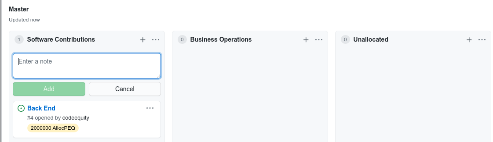

# CodeEquity Manual


CodeEquity is based on a simple truth: ***If you help create something, you should
be among those that benefit from it***.

Traditional established companies pay employee salaries, promise stability, and provide many perks
including: insurance, retirement plans, office space, computing environments, lots of free coffee, and
more.  In return, those companies own all of the output of every one of their employees.  Startup
companies are similar, but in place of stability, retirement plans, and competitive wages,
they offer small amounts of equity in order to attract skilled employees.

There are other models for organizing teams to create products.  GitHub provides a space for the
primary alternative today in the software development world.  Most new ventures in the GitHub space do not
offer money or equity to compensate skilled contributors.  Nor do they offer office space, insurance,
retirement plans, or lots of free coffee.  Instead, they offer social recognition and a sense of
purpose.  These incentives can be powerful, but only up to a point. 

CodeEquity proposes that these new ventures additionally offer up their primary currency - 
***ownership*** - as the key incentive to attract skilled contributors.  CodeEquity is both a legal
framework and a software framework that makes this simple idea easy to put into practice, and
iron-clad should the venture become successful down the road.

In the big picture, CodeEquity is an attack on the greatest remaining barrier to large scale
technical innovation: the human factor.  Up until now, the necessary ingredients for a venture to
take off have been: lots of money to pay for wages, stuff and services, some luck, and a good idea.
Some luck and a good idea will always be necessary components for success, but startup money?  The
underlying equation has changed over the last decade with the advent of dependable internet and
cloud-based compute services, code and project management.  We no longer need most of the trappings
of a traditional company. What's left is the human factor: How do you attract several person-years
of skilled, dedicated help without the money to pay wages?  Fully sharing equity is the only answer
that has a chance to reshape or destroy this final blocker to full merit-based technical innovation.

How much more dynamic, inventive and sizeable would the GitHub community be if contributors saw the
potential, however slight, of making a living or better by contributing to a project?

For the *potential contributor* the choice is clear.  All else being equal between two projects of
equal merit, one of which is a CodeEquity project, and one which is not, why contribute to the
project that does not share equity?

For the *founders* the choice is easy as well.  Most new ventures find it hard to attract skilled
contributors.  Is there a more powerful way to attract them than by offering equity?  Doing so will
reduce the equity you can retain personally ... but the equity you do retain has a much higher chance
of being worth something down the road if you can get good help early on.

For the potential contributor to CodeEquity software itself, well, yes, we are a CodeEquity project,
so consider joining the team!

## CodeEquity Key Concepts

Equity in a CodeEquity project is earned by making contributions to that project.  In a typical
company, equity is granted once a year to a person privately based on the subjective
evaluation of that person's boss.  In contrast, equity in a CodeEquity project can be earned at any point during
the year.  The equity value of any contribution is known to all, up front, and the accrual of equity
is both objective and public.

Several common CodeEquity terms and concepts are introduced below, primarily to help make
the manual concise and understandable.  These introductions are for common reference only.  For
binding definitions and details, refer to the **CodeEquity Venture Equity Agreement**.


### CodeEquity Ventures & Projects

A CodeEquity Venture is analogous to a company.  Equity within a company is separate and distinct
from equity within a second company.  A CodeEquity Project is analogous to a project, or part of a
project within a company.  Equity within a company may be earmarked for different projects or
purposes within that company.

For example, Jessie has a great idea for an app that allows people within a community to browse,
borrow, and loan books with each-other, and has decided to pursue this idea within the CodeEquity
framework.  Jessie is calling the app "BookShare".  To simplify planning, Jessie decides to break the app's
development tasks into several smaller projects: *BookShare frontend*, *BookShare backend*, and *BookShare
operations*.  In this example, the CodeEquity Venture is BookShare.  The Venture is made up of three
CodeEquity Projects: *BookShare frontend*, *BookShare backend*, and *BookShare operations*.
CodeEquity will track and collate provisional equity across the three projects and report it within
the umbrella of the Venture: BookShare.  Jessie could have chosen a different way to structure
BookShare within the CodeEquity framework, but this breakdown is simple and functional.


### Provisional Equity (PEQ)

In point of fact, *equity* is not earned in CodeEquity Ventures, but rather *provisional equity* is.
Equity in a company requires the company to exist as a legal entity such as an LLC or a Corporation.
This is not a useful step for most early ventures.  It takes time and money to set up these
entities, both of which can be better spent developing and testing the ideas for the venture.

Provisional equity are normal stock options, provisional on the venture being converted into a legal
business entity at some point in the future.  The CodeEquity promise, secured by the CodeEquity legal framework, is that every
share of provisional equity owned by a contributor will be converted 1:1 to a stock option in any
company created from the venture.  Furthermore, any revenue gained by a CodeEquity Venture (for
example, with the sale of related intellectual property) that is not fed back into the venture will
be split among contributors according to how many shares of Provisional Equity they have accrued.

For binding definitions and details, refer to **Provisional Stock Options** in the **CodeEquity Venture Equity Agreement**.  
For simplicity of reference throughout CodeEquity, one provisional stock option is denoted as *1 PEQ*,
or *one share of provisional equity*.


### PEQ Issues

A CodeEquity Project will normally be planned and tracked with a collection of *issues* managed 
with project management software, such as GitHub project boards.  Common issues
involve planned features, feature requests, bug reports, and operational tasks.

A PEQ issue is any issue that has a PEQ value attached to it.  For example, the *BookShare frontend*
project might have an issue: "Add book detail page".  Without an associated PEQ value, this is not a
PEQ issue.  Once Jessie adds, say, a "1000 PEQ" label to the issue, it becomes a PEQ issue and will
be subsequently tracked by CodeEquity software.


### CodeEquity Software Framework Mandate

All elements of CodeEquity's software exist to aid in tracking and managing the provisional equity
associated with a CodeEquity Venture.  This responsibility lasts up until when the Venture converts
to a legal corporate entity and the provisional shares are converted to stock options in that new
entity, at which point the new legal entity takes over.

To support this mandate, CodeEquity software tracks and stores every action that impacts the
resolution of every PEQ issue.  Likewise, CodeEquity is free to ignore actions that
have no impact on the resolution of non-PEQ issues.  For example, CodeEquity tracks
operations like adding a PEQ label to an issue, closing a PEQ issue, or changing who is assigned to
a PEQ issue.  For example, CodeEquity ignores operations like creating an issue that does not have a
PEQ label, adding a comment to an issue, or changing the name of a project column that does not have
associated PEQ issues.

CodeEquity ensures that once PEQs have accrued (i.e. provisional equity has
been earned by a contributor), all characteristics of those PEQs are immutable.  For example, if
Alex earned 1000 PEQs for implementing a new feature for BookShare, they can not be taken away or
changed down the road.


# CodeEquity for GitHub

CodeEquity is built to interface with any code hosting platform that can meet certain requirements.  The
core elements of CE Server and CE Flutter are agnostic to the host platform the CodeEquity Project
is hosted on.  This portion of the manual is specific to CodeEquity for GitHub.

CodeEquity works with GitHub through
[project boards](https://docs.github.com/en/github/managing-your-work-on-github/managing-project-boards/about-project-boards),
which is a Kanban-style project management
tool.  GitHub projects are a great way to track the lifecycle of all the issues related to a
project throughout the duration of the project.
They are quick to learn, and functional enough to easily support small to medium-sized projects and
teams (for example, explore some [active projects at Google](https://github.com/orgs/google/projects?query=is%3Aopen)).
GitHub has integrated their project boards with all core elements of its repository
management toolkit, and provides a push-based notification system for external
application integration.  CodeEquity utilizes this notification system along with GitHub's Octokit
REST and GraphQL APIs to build a wrapper around any Github repository, converting it and it's elements into a part of a CodeEquity
Project.

GitHub repositories are owned by individuals or organizations.  A GitHub organization can own many GitHub repositories, each of which contains a collection of
GitHub issues.  Each issue may be a member of one or more GitHub projects.  An issue may participate
in many GitHub projects, but only belongs to one repository.
A GitHub project serves as a view over a collection of issues, no matter which repository each issue belongs to.  Organizations typically use 
projects to indicate meaningful, distinct bodies of work, and important categorizations within
that body of work, such as progress.  These categorizations are reflected, in part, by the columns
used in a GitHub project board.

A CodeEquity Venture corresponds directly to a GitHub organization.  Each CodeEquity Venture may contain one or more CodeEquity Projects.
Each CodeEquity Project may contain many GitHub repositories, but each repository may only belong to
one CodeEquity Project.  CodeEquity's front end interface, CE Flutter, provides a drill-down
summarization of the provisional equity in a CodeEquity Project, in part by using GitHub project names and columns.
Finally, a PEQ issue corresponds directly to a special case of a GitHub issue.

> Note that in 2022 GitHub deprecated their *Classic Projects* and the corresponding API, and introduced a new version
of GitHub projects with a new API.  The new GitHub projects notification system only works for GitHub Organizations.
As a result, individuals must establish an organization account in GitHub in order to use
CodeEquity. To do so, follow these steps: XXX.

The image below shows a typical GitHub project.  This project is for "LUCI", and is being shown in a Kanban
board style view.  GitHub projects also support a few spreadsheet-oriented views.  View choice does not impact
any underlying functionality in GitHub, or in CodeEquity.  For simplicity of presentation, however, *this
manual only uses Kanban project board views and terminology*.  For example, "LUCI" is composed of three columns and a
handful of issues that belong to the project.  Each issue is represented as a card in a column of
the project board.  All information related to an issue is stored in the issue.  GitHub uses labels with issues to help manage the
attention of the project's collaborators.  For example, common labels deal with feature requests, bugs,
severity, and so on.  Issues contain a history of comments, can be assigned to collaborators, they can be
opened, closed, transfered and edited. 

<p float="left">
  
</p>

<br>

This next image shows a typical CodeEquity project in GitHub.  There are a handful of key
differences that can be seen here.


<p float="left">
  
</p>

<br>

CodeEquity adds two new types of labels, called PEQ (remember, Provisional EQuity) and AllocPEQ labels.  For example,
the *Close open test* card in the **Accrued** column has the label ***1000 PEQ***.  This label
informs CE Server that the *Close Open test* card, or rather the issue linked to it, is valued at
1000 shares of provisional equity.  In contrast, an AllocPEQ label such as ***200,000 AllocPEQ***
indicates that the task described in the related card has been allocated 200,000 PEQs for planning,
but has not yet been fully tasked out.  There can only be one PEQ or AllocPeq label per issue.

CodeEquity projects also have two reserved columns: **Pending PEQ Approval** and **Accrued**.  When
a card moves to the **Pending PEQ Approval** column, it serves as a signal to CE Server that the
underlying issue is completely resolved.  It also
serves as a request to whomever has approval authority on the project, to confirm that the issue
has been resolved in a satisfactory way.  The approver confirms by moving the card
into the **Accrued** column.  The act of moving a card into the
**Accrued** column is an explicit acknowledgement to the team, and to CodeEquity, that the
assignee(s) on the issue have just accrued the PEQs related to that issue.  For example, when *IR
Pending* moves to the **Accrued** column, one thousand PEQs will accrue and be evenly distributed to
the two assignees on the issue.

The final significant difference between a normal GitHub project, and a CodeEquity project, is that
CE Server enforces a 1:1 mapping from issues to cards in a CodeEquity project.  Otherwise, if
one issue has multiple cards, there is no clean way to determine how and when the
associated PEQs should accrue.  CE Server enforces this mapping by force-duplicating and renaming the issue
every time a user attempts to add an issue to a second project column.  The only exception to this
rule is issues without any cards, or "newborn issues".  CE Server ignores all newborn issues, as
they are not related to provisional equity.

There are other differences as well, mainly to ensure that a CodeEquity project stays in a valid state.
These differences are smaller in scope, and are introduced below.  

<br>
<br>


# Common Lifecycle Examples

The initial signup and startup for every CodeEquity project is identical.

The first step is to install the CodeEquity App for GitHub, following the instructions [here](#codeequity-app-for-github).
The default installation enables all of the repositories owned by your organization to be part of 
a CodeEquity project. Those repositories that are never pulled into a CodeEquity project will not be
modified in any way by CE Server.

Next, browse to www.codeequity.net, and sign up for CodeEquity.  Part of this process
involves reading and signing the equity agreement that all contributors to your venture
will sign, ensuring their fair share of provisional equity.

The third and final step in the early thinking for any CodeEquity project is, well, thinking about the
equity.  *How much total (provisional) equity will there be in the venture?*  *How much should each
task be worth?*  The CodeEquity website proposes a default starting point for any software venture.
(XXX revisit XXX)  See [common equity structures](docs/adoc.md) for the rationale and 
details on this default setup.  There are a few important points to keep in mind here:
   1. No decision at this point is permanent.  In fact, you should expect overall PEQs and PEQs per
task to change over time.  

   2. The total number of allocated PEQs doesn't matter.  What matters is the percentage of
PEQs a person has accrued compared the overall total accrued in the venture (XXX revisit XXX) , when it comes
time to convert PEQs into equity in a legal entity.  That percentage will develop over months and years, not days.

So, your early choices here **are useful to start communications with contributors**, but beyond that,
they are **neither major nor permanent**.

The default equity structure authorizes 7 - 10 million shares of provisional equity (provisional stock) up front for
software development, which is 30-50% of the overall provisional equity in the venture.  The default
plan assumes three person-years of work for a typical small software venture to get the code in place to
make a run for it.  This works out to be, roughly:
   * 1,000 PEQs for tiny tasks, of maybe an hour or so,
   * 10,000 PEQs for one person-day of work,
   * 50,000 PEQs for one person-week of work.  

### Creating a CodeEquity Project Structure from Scratch

A CodeEquity project can be converted into from an existing GitHub repository, or created from
scratch.  This first example follows Connie creating a CodeEquity Project as a completely new
project.  Connie is already a contributor to several repositories owned by other people and organizations, and is the
owner of several others.  Connie is planning to start exploring a brewery
simulation game as a CodeEquity Project, and Venture.  Connie has already created the GarlicBeer public
repository, the GarlicBeer organization that owns it, and has a few files therein.  Connie has not yet started a GitHub project board.

Connie starts by [signing up](#common-lifecycle-examples) for CodeEquity, following the default
installation for public repositories.  Connie also sticks with the default equity structure proposed
by the CodeEquity website, comfortable that as the project evolves, so can the equity structure for
GarlicBeer.

<br>

#### GarlicBeer Project Structure

A CodeEquity project can work with any collection of user-specified columns in GitHub projects.  Once
you start creating and manipulating PEQ issues in your project board, CE Server will create the two
reserved columns **Pending PEQ Approval** and **Accrued** as needed.  CodeEquity projects also
support a hierarchical project structure, which can make organization and reporting more cohesive.
(XXX revisit XXX)

The GarlicBeer repo so far has no issues, and no related project boards.  Connie decides to adopt 
CodeEquity's recommended hierarchical layout as a starting point.  In this approach, a user creates
several GitHub projects to help organize tasks in the GarlicBeer CodeEquity project.  The top level
project is named `Modules` (see [config.js](webServer/config.js) to modify names) by default.  The
child projects are named after the cards in the columns of the `Modules` project.  In CE Flutter,
PEQs for contributors and the overall venture can be 
grouped and summarized by columns in the `Modules` project.

Connie creates one column in `Modules` for `Software Contributions`, one for `Business
Operations`, and a third for `Unallocated`.  The `Unallocated` column is a handy way to inform
CodeEquity that all unallocated equity should be summarized as a sibling of the software and bus-ops
columns.  

(XXX revisit XXX) images have master not modules

<p float="left">
  
</p>

In the **Software Contributions** column for `Modules`, Connie decides to start with very broad
categories, each of which will be a GitHub project in its own right: *Front End*, *Back End* and another
*Unallocated* card that serves as a placeholder for provisional equity for other work in **Software
Contributions** down
the road.  Unallocated cards in `Modules` should not be matched with a related project.
As a side note, remember that CE Server enforces a 1:1 mapping between issues and cards.  As a
consequence, each of these cards are based on actual issues that are members of the `Modules`
project. 

Connie starts by creating an allocation label in GitHub's label interface.  Connie gives the new label
the name "2M AllocPEQ" and creates the label.  When creating labels, CE Server looks for
any label name matching a digit followed by "AllocPEQ" or "PEQ", then reworks the label into a proper CodeEquity
label for future use.  CE Server accepts numbers with or without commas, and "k" or "M" shortcuts to
represent numbers.  For example these are all accepted: "1,000 PEQ", or "1000 PEQ", or "1k PEQ".
Connie then creates a new *Back End* issue, assignes the new label, and adds the issue to
the **Software Contributions** column of the `Modules` project.  

When building the label, Connie types: 

(XXX revisit XXX) now wrong
<p float="left">
  
</p>


Then Connie creates the new issue: 

(XXX revisit XXX) now wrong
<p float="left">
  
</p>

which results in: 

(XXX revisit XXX) now wrong
<p float="left">
  
</p>

If you are familar with GitHub, you will notice that the result is a card linked to an open issue with
the name `Back End`, and a label of `2M AllocPEQ`.  Using CodeEquity's default suggestion of
`10,000 PEQ` for one person-day of work, this means Connie has made a rough allocation of 10
person-months of work for the back end.  If this turns out to be wrong later (which is almost a
certainty), that allocation can be adjusted in either direction with no bad consequences.

Connie adds a few more high-level allocations in `Modules`, resulting in: 

<p float="left">
  
</p>

At this point, Connie is done with high level allocations.  Connie's rough estimate is 
that the front end and the back end will each need 2 million PEQs to complete, and has added a
buffer of another 2 million PEQs for whatever comes up under **Software Contributions**.  Similarly,
Connie has estimated a million PEQs for **Business Operations**.

The `Modules` project is now done for now, the child projects are next.  There are two additional projects to
create, one for each card in `Modules` that is not an *Unallocated* card, namely *Front End* and
*Back End*.  While not a requirement, CodeEquity recommends choosing columns in these child projects that support the natural
flow of an issue in a CodeEquity project: planned, in progress, pending PEQ approval, and accrued
(or approved).  Connie decides to proceed with this recommendation, ending up with the following
projects:

<p float="left">
  
</p>

and the following column layout in each child project:

<p float="left">
  
</p>

<br>

#### Basic Issue Lifecycle

Connie wants a hands-on understanding of what happens with a PEQ issue as it works its way through
the project.  Connie starts with creating a new PEQ label, and using it to create the following PEQ issue:

<p float="left">
  
</p>

resulting in: 

<p float="left">
  
</p>

By clicking into the issues tab, Connie can see the current set of issues (all PEQ issues, so far) that have been created:

<p float="left">
  
</p>

Clicking into the *Test PEQ LifeCycle* issue, Connie adds an assignee, then back in the projects
page, Connie drags and drops the card into the **In Progress** column.
Connie goes back and forth playing with this a few times before leaving the card in **In
Progress**.   If Connie were to try dragging the card into the
**Accrued** column right now, CE Server would move the card back to **In Progress**.  PEQ issues
can only enter **Accrued** from the **Pending PEQ Approval** column.

(XXX revisit XXX) card should be coming from planned
<p float="left">
  
</p>

<p float="left">
  
</p>

Now Connie clicks back into the issue, and clicks `Close issue`	in GitHub.  CE Server sees this
notification and automatically moves the card into the **Pending PEQ Approval** column.
Alternatively, Connie could have dragged the card from **In Progress** to **Pending PEQ Approval**,
and CE Server would have automatically closed the issue.  Connie
clicks back into projects to verify this: 

<p float="left">
  
</p>

Connie then clicks `Reopen issue` and `Close issue` a few times to see how the card moves, leaving
the card in the **Pending PEQ Approval** column.  Finally, Connie clicks into the `Front End`
project again, and drags the card into the **Accrued** column:

<p float="left">
  
</p>

Note that the history of these actions has been caught by GitHub, including which individual
caused the actions to occur.  For example, the first red circle shows `connieCE closed
this` which reflects the fact that Connie closed the issue.  The action immediately following is
`codeEquity (bot) moved this`, reflecting the fact that CE Server moved the card to the **Pending
PEQ Approval** column as a result of Connie closing the issue.

<p float="left">
  
</p>

<br>

#### GarlicBeer in CE Flutter

Done with GitHub for the moment, Connie opens the CE Flutter app to see what has happened: (XXX REVISIT XXX).

<br>
<br>


### Converting an Existing Project in GitHub into a CodeEquity Project

This second example follows Jessie converting an existing project in GitHub into a CodeEquity
project.  In this example, the project is encapsulated in one repository (BookShare), and one GitHub project
board (BookShareFE for front end), but the concepts work for a project that crosses multiple repositories and project boards.

Jessie is already a contributor to several repositories owned by other people, and is the 
owner of several others.  Jessie has been exploring the idea of a community book sharing app,
and has started working on it.  Excited by the possibility of attracting more developers, Jessie
decides to create a BookShare Venture, and convert the BookShare repository 
into a CodeEquity Project.  The BookShare repository, and several participating GitHub projects are already in active use.

Jessie starts by [signing up](#common-lifecycle-examples) for CodeEquity, following the default
installation for public repositories.  Jessie also sticks with the default equity structure proposed
by the CodeEquity website, comfortable that as the project evolves, so can the equity structure for
BookShare. 

While at CodeEquity.net, Jessie selects the `Convert BookShare` option, which refers to the BookShare repository.
The CodeEquity website passes this instruction to CE Server, where most of the internal conversion work occurs.
CE Server will initialize internal state (see [Linkages](#linkages)), and enforce the 1:1 mapping rule between issues and cards in the new
CodeEquity project by duplicating and renaming any issue that is pointed at by more than one card.
The new issue names are identical to the original name, but with a random alpha-numeric string
appended to the end of it.

Could Jessie have started by converting a related BookShare *project*, for example BookShare Front End, instead of the entire repository?
The simple answer is "no".  

In GitHub, every issue resides in exactly one repository.  GitHub Projects, however, are unrestricted views over issues from any number of
repositories within an organization.  In other words, repos and projects are independent organizational entities ... one is for content (repo),
one is for views (projects).  The CodeEquity mandate is to manage the provenance of provisional equity, which is primarily a content-level task.  Views
are solely used for summarization (both in CodeEquity and GitHub) while reporting.  If CodeEquity Projects were tied directly to GitHub Projects, several points
of friction would immediately pop up.  For example, during conversion, CE Server enforces the 1:1 mapping rule by force-duplicating and renaming
all issues with multiple cards.  Since a GitHub Project can contain issues across multiple repositories, CE Server would be remapping issues and
cards in repositories that otherwise have no connection to the CodeEquity Project at hand.  

After conversion, BookShare is now a valid CodeEquity project.  In the related GitHub project
BookShareFE, all pre-existing columns are preserved, as
well as all pre-existing cards, issues and labels.  This will be true no matter the related
projects, althgou CE Server may create extra issues and cards
to preserve the 1:1 mapping.  The reserved columns **Pending PEQ Approval**
and **Accrued** will be added as soon as a PEQ issue is closed.  The reserved PEQ and AllocPeq
labels will be added as soon as a PEQ issue, or an allocation are added to the project.  From
this point on, all changes in BookShare maintain it's valid status as a CodeEquity Project.

Jessie's BookShareFE GitHub project now looks identical to how it looked before becoming 
part of a CodeEquity project:

<p float="left">
  
</p>

While BookShare is a valid CodeEquity project, it does not have a single PEQ issue, nor is there 
any provisional equity, and as such it is a CodeEquity project in name only.  Jessie wants 
to make substantive use of CodeEquity, and so carries out the next several steps:
   * *Columns:*  Adds the column **Planning** (*optional*).  Renames the default **In Progress**
column to **Underway** in the CodeEquity website (*optional*).

   * *PEQ labels:* Adds a handful of PEQ labels by clicking on `Issues`, in GitHub, then
`Labels`, then `New Label`.  Types in a PEQ label name, like `1000 PEQ` and clicks on `save`.  CE
Server rebuilds this into a valid PEQ label (which Jessie can only see after a screen refresh).
(XXX Revisit XXX) 

   * *Allocations:* Adds several large allocations.  Allocations are a way to indicate
an estimated value of a large chunk of work that is currently not scoped out.  For example, the
*Expand Flutter Testing* card with **500k AllocPEQ** label indicates a large chunk of untasked work
under the general category of expanded flutter testing.  See
[GarlicBeer](#garlicbeer-project-structure) for more allocation examples. (XXX revisit XXX)

   * *Update issues:* Adds assignees and PEQ labels to the existing issues.  Adds a few extra labels
to help identify which part of the front end the issue belongs to.  In order to help keep the
initial conversion as simple as possible, no cards will move with the addition of a PEQ label.  So if an issue had been closed earlier, and there are
assignees, and a PEQ label is added, CE Server will NOT move that related card into the **Pending PEQ
Approval** column.  Contributors should move these by hand. (XXX revisit XXX) verify

   * *Move closed PEQ issues:* Moves all closed PEQ issues with assignees to the **Pending PEQ
      Approval** column.

At the end of this, the project looks like this:

<p float="left">
  
</p>

<br>

#### BookShare in CE Flutter

Done with GitHub for the moment, Jessie opens the CE Flutter app to see what has happened: (XXX REVISIT XXX).

<br>
<br>

# CodeEquity Architecture Overview

CodeEquity is composed of the following major components:

<p float="left">
  
</p>

<br>


* **CodeEquity GitHub App**.  A GitHub app that converts GitHub repositories into CodeEquity projects.
* **CE Flutter**.  A multi-platform front end for managing CodeEquity projects.
* **CE Server**.  A Node.js Express server that handles requests from the CodeEquity GitHub App and
                  CE Flutter, and manages all related modifications to provisional equity.  
* **AWS Backend**.  A serverless backend for CE Server responsible for storing and supplying all data
                and updates related to provisional equity.

### Overview: CodeEquity App for GitHub

The CodeEquity App for GitHub is (XXX or will be) available in the GitHub Marketplace.  The CodeEquity
App connects an organization's GitHub repositories to CE Server, by means of the GitHub notification system.
Once installed, any 
[repository](https://docs.github.com/en/repositories/creating-and-managing-repositories/about-repositories)
can be transformed or added into a CodeEquity project.

The CodeEquity App is actually just a cohesive set of notification requests and permissions that allow
GitHub and CE Server to begin communicating.  As such, the app has no logic or state specific to it.


### Overview: CE Flutter

CE Flutter is a Flutter app for desktop and mobile devices that is used to manage CodeEquity
projects.  CE Flutter communicates directly with the AWS backend for provenance related to
provisional equity, collaborator agreements, equity agreements and more. 


### Overview: CE Server

CE Server is a Node.js Express server.  CE Server has two primary functions for CodeEquity projects
in a GitHub repository.  First, it records all interactions with provisional equity-related issues,
cards, columns and labels in order to fully track the provenance of all related provisional equity.
Second, CE Server makes changes on behalf of a user in the CodeEquity project in GitHub to ensure
the project remains in a valid state.  CE Server does also manage a small amount of state, which
helps provide a significant speedup to it's GitHub operations.

### Overview: AWS Backend
The AWS backend is a serverless architecture on AWS. The architecture is specified with a [yaml
file](ops/aws/samInfrastructure.yaml) that is a mixture of AWS's SAM and CloudFormation
specifications.

Requests from CE Server and CE Flutter are signed with JWT tokens secured from AWS Cognito running
with a user pool.  Signed requests are sent to AWS Lambda functions via AWS Gateway.
[awsDynamo](ops/aws/lambdaHandlers/awsDynamo.js) contains the key lambda handlers for the backend.
Their primary function is saving and retrieving data from a collection of AWS DynamoDB tables.

All communication with the AWS Backend is encoded as JSON REST data.


# CodeEquity App for GitHub

The CodeEquity App for GitHub can either be found in the GitHub Marketplace, or by browsing directly
to https://github.com/apps/codeEquity.  Installing the app will allow the GitHub repository owner to
convert any GitHub repository into a CodeEquity Project, or to start a new CodeEquity Project
from scratch.

The CodeEquity App for GitHub should be installed by the GitHub repository owner, only.
Contributors to a project do not need to install this app. 

To install:
 * browse to https://github.com/apps/codeEquity, click 'install', and accept defaults.

If you are installing CodeEquity for a private repository, you will need to provide a personal
access token.  To create a personal access token for CodeEquity,
 * browse to https://github.com/settings/tokens, click "create a new token.
 * add a note, like "for CodeEquity" at the top
 * set the scope to be "repo  full control of private repositories"
 * click generate at the bottom
 * use CE Flutter to save this token.

There is very little to this app, as mentioned in the overview.  It is a cohesive set of
notification configurations and permissions, along with the address of CE Server so that GitHub knows where to send
the notifications to.  The notifications are JSON REST, see a full example of one below.

# CE Server

CE Server is a Node.js Express server.  The host GitHub sends notifications to CE Server whenever a change is
made to a CodeEquity Project, as directed by the CodeEquity App for GitHub.  The express
specification is found in [ceServer.js](ceServer.js), which establishes
[ceRouter.js](routes/ceRouter.js) as the central dispatcher for CE Server.

The main notification types in GitHub include: `issue`, `project_v2_item`, and `label`.  The `issue`
notifications tend to deal with content, whereas the `project_v2_item` notifications tend to deal
with view modifications such as card creation and location updates.  There are other
types, for example `synchronize` or `repository`, but these are irrelevant to CodeEquity.  The
payloads for each notification type vary (details can be found
[here](https://docs.github.com/en/developers/webhooks-and-events/webhooks/webhook-events-and-payloads#issues),
but often carry information like action, repo, issue, timestamp and so on.  A simplified example of a
`labeled` action for an `issue` notification is shown below.

```
{ action: 'labeled',
  issue: 
   { url: 'https://api.github.com/repos/codeequity/codeEquity/issues/57',
     repository_url: 'https://api.github.com/repos/codeequity/codeEquity',
     number: 57,
     title: 'simple',
     user: 
      { login: 'rmusick2000',
        url: 'https://api.github.com/users/rmusick2000' },
     labels: [ [Object] ],
     state: 'open',
     created_at: '2020-07-12T20:38:39Z',
     updated_at: '2020-07-12T20:38:39Z' },
  label: 
   { url: 'https://api.github.com/repos/codeequity/codeEquity/labels/500%20PEQ',
     name: '500 PEQ',
     color: 'ffcc80',
     default: false,
     description: 'PEQ value: 500' },
  repository: 
   { name: 'codeEquity',
     owner: 
      { login: 'codeequity' },
     html_url: 'https://github.com/codeequity/codeEquity',
     default_branch: 'modules' },
  sender: 
   { login: 'rmusick2000' }}
```

All communication with the GitHub is encoded as JSON REST data.  CE Server will make REST calls to GitHub's
GraphQL interface with as a service to the user, to help keep the CodeEquity project
in a valid state.  Calls to GitHub may fail for a variety of reasons.  An error handler in
[ghUtils.js](./ghUtils.js) will retry operations a number of times if the error type is
recognizable.  

A key challenge for CE Server is that the server, AWS and GitHub are all marching along to a
different clock.  CE Server starts to act only after receiving notifications from GitHub.  GitHub
will send notifications after an action has already been registered, and sometimes before all
aftershocks of that action have completely resolved.  GitHub sends these notifications independently
of what CE Server is currently working on.  Much of the effort in CE Server revolves around dealing with
the asynchronous nature of these pairings.

## `ceRouter` Job Dispatch
At the time of writing, CE Server is singly-threaded with no thread pool or worker threads.

### `ceJobs`
In a well-behaved world, the handler in `ceRouter` would simply reroute each notification to
the host handler `githubRouter`, and from there to a specific handler like
`issueHandler` (good for the `issue:labeled` notification above).  As is typically the case for servers in
the wild, however, that doesn't work here.   

The most common way in which this fails is when a group of notifications arrive at CE Server in
close proximity (by time).  By default, each time a new notification arrives, it acts as an
interrupt, delaying whichever notification was already being handled.  Over time, the currently
pending operations interleave in the server in unpredictable ways.  This has several impacts,
including difficult debugging, out of order execution (vs. the originating actions in GitHub)
becoming the norm, and job starvation.

CE Server handles this with a FIFO (first in first out) queue in `ceRouter` called `ceJobs`.
Every notification that arrives interrupts `ceRouter` long enough to add the job details to
`ceJobs`, then processing continues with the first job on the queue.  In this manner, actual server
operations begin and end with a single notification before starting on the next notification, and
job starvation is not an issue.

### Demotion
The `ceJobs` queue ensures that each notification is treated by CE Server as one atomic unit, in other
words, no other notification can interfere with it during processing.  

> Note: This is an over-simplification, as some portions of jobs that are self-contained are allowed
  to interrupt a currently active job.  For example, job1 may end up recording the raw JSON payload
  related to a PEQ issue notification on the AWS back end.  Since CE Server does not operate on these
  raw notifications, job1 may terminate without waiting for the AWS
  update to be constructed and sent upstream, and the server may begin operating on job2.  In cases
  like this, the self-contained portion of job1 may interleave with any portion of job2 on the queue.

The `ceJobs` queue does not address out of order operations, however, which can lead to uncommon but
pernicious failures due to dependency issues.

Many operations in GitHub generate several component notifications.  For example, creating an issue
can generate an `issue:open` notification, several `issue:assigned` notifications, several
`issue:labeled` notifications and more.  The notifications are all sent at roughly the same time,
and can arrive at CE Server out of order.  There is no sequencing or grouping information in the
notifications, and the timestamps are not dependable (for example, stamps only record to the second,
and different stamps for the same operation can vary by as much as 10s!).

To manage this, if a subhandler of `githubRouter` detects a dependency issue, it will direct
`githubRouter` to demote the current job by pushing it further down the `ceJobs` queue, so that the job it
depends on can be handled first.

##### Example

Jessie is creating a new issue in BookShareFE, called *Blast 1*.   Jessie has filled out the issue
details, including who is assigned to it, and has given the issue a PEQ label.  As soon Jessie
clicks `Submit new issue` in GitHub, GitHub sends `ceRouter` a slew of notifications.  At some point
during processing, the `ceJobs` queue looks like this (minus the payload for each notification): 

```
ceJobs, Depth 2 Max depth 11 Count: 236 Demotions: 1
    jessie BookShareFE yPqzTssMts issue assigned Blast 1 1622310313268 0
    jessie BookShareFE NRwxaJRGlv issue labeled Blast 1 1622310313440 0
```

The handler treats assignments differently depending on if the issue is a PEQ issue, or not.  At
this point in time, we can tell from the information in the notification that *Blast 1* is a PEQ
issue, but CE Server won't have pushed this information up to the AWS backend until the second item
`issue:labeled` in the queue is processed.

The  `issue:assigned` job will be popped off `ceJobs` first, and sent to the issue handler.  During processing,
the handler notices that dependencies are incorrect, and requests the job be demoted

```
<issue: assigned Blast 1>  start yPqzTssMts
<issue: assigned Blast 1>  assigned jessie to issue 906524064
<issue: assigned Blast 1>  Get PEQ from issueId: 906524064

Assignment to peq issue, but peq doesn't exist (yet).  Reshuffle.
<issue: assigned Blast 1>  Delaying this job.
Demoting yPqzTssMts 1
```

After the demotion, `ceJobs` shows that the assignment job as been pushed further down on the stack.

```
ceJobs, after demotion Depth 2 Max depth 11 Count: 236 Demotions: 2
    jessie BookShareFE NRwxaJRGlv issue labeled Blast 1 1622310313440 0
    jessie BookShareFE yPqzTssMts issue assigned Blast 1 1622310313477 1
```

Demotions are based on the arrival timestamp (the big number in the example above) of the
notification.  Early demotions will drop at least two jobs down, but no more than a few hundred
milliseconds.  If a job continues being demoted, the minimum time delay grows.  If a job has been demoted more
than a set number of times (default is 30), the server will drop it with an error, and move on the
the next job.  The values controlling this operation can be configured in
[config.js](webServer/config.js).


## Linkages

CE Server's subhandlers interact with GitHub via GraphQL API, and with the AWS Backend through it's
Lambda interface (XXX revisit XXX) links.  These APIs
frequently require information related to the operation at hand that can not be found in the
notification's payload.  For example, closing a PEQ issue in GitHub will cause CE Server to move that issue
into the **Pending PEQ Approval** column.  The move requires the project ID and column ID of the
target column, neither of which are to be found in the `issue:closed` notification.  

Requesting this information on the fly from GitHub more than doubles the request volume and the
subsequent await times, leading to a noticeable lag for the GitHub user.  To avoid this, CE Server
tracks two pieces of state.  The first is the `ghLinks` table shown below, which gathers the most
frequently required names and ids surrounding an issue.

```
IssueId IssueNum CardId  Title                               ColId      ColName              ProjId     ProjName        SourceCol 
906523785 559 62095884   Github Operations                   14524013   Software Contributio 12566158   Modules          14524013  
906523791 560 62095889   Unallocated                         14524013   Software Contributio 12566158   Modules          14524013  
906523793 561 62095893   Unallocated                         14524014   Business Operations  12566158   Modules          14524014  
906523901 562 62095914   Snow melt                           14524020   Accrued              12566159   Data Security   -1        
906524003 563 62095929   Ice skating                         14524020   Accrued              12566159   Data Security   -1        
```

The second is a `ghLocs` table shown below, which tracks the ids and names of the projects and
columns in each CodeEquity Project.  
```
Repo                 ProjId     ProjName        ColId      ColName             
ariCETester/CodeEqui 12566158   Modules          14524013   Software Contributio
ariCETester/CodeEqui 12566158   Modules          14524014   Business Operations 
ariCETester/CodeEqui 12566158   Modules          14524015   Unallocated         
ariCETester/CodeEqui 12566159   Data Security   14524016   Planned             
ariCETester/CodeEqui 12566159   Data Security   14524017   In Progress         
ariCETester/CodeEqui 12566159   Data Security   14524019   Pending PEQ Approval
ariCETester/CodeEqui 12566159   Data Security   14524020   Accrued             
```

CE Server keeps `ghLinks` and `ghLocs` up to date with every operation on projects and columns in
GitHub, and regenerates the state from scratch should the server be restarted.  Together, this state
information is responsible for significant speedups when responding to user operations on GitHub.

## Authorizations

CE Server uses several APIs to communicate with GitHub and the AWS Backend:
* The [Octokit REST API](https://octokit.github.io/rest.js) for GitHub
* The [Octokit GraphQL API](https://docs.github.com/en/graphql/reference) for GitHub
* An [AWS Lambda Gateway](https://docs.aws.amazon.com/lambda/index.html) for CodeEquity's AWS Backend

Each of these requires a different form of authorization.
(XXX revisit XXX) verify octokit is out.  verify entire section.

##### CodeEquity App for Github credentials  (enabled upon app install)

When the CodeEquity App for GitHub was built, a set of private key credentials were created and
associated with the app identifier.  Every time you install the CodeEquity App for GitHub for a new repo,
GitHub internally authorizes the app (via the private key credentials) to interact with the repo.

These credentials are stored in `ops/github/auth`, and used by CE Server to acquire the Octokit
credentials described below.  Additionally, CE Flutter will on occasion
communicate directly with GitHub through Octokit.  To make this feasible, the app credentials are
also copied into the CE Flutter space as part of the flutter build step.

Note that CodeEquity has a separate testing app for GitHub, called "ceTester", described in the
**Testing** Section below.  ceTester generates GitHub activity under a separate testing account
through the GitHub GraphQL API, and so requires it's own set of app credentials.  These are stored
as siblings to the credentials for the main CodeEquity App for GitHub.

##### Installation client for Octokit (refreshed hourly by CE Server)

GitHub's Octokit REST API requires an installation access token for all requests on a GitHub
repo.  CE Server acquires this token by using the private key credentials of the app making the
request, in other words, the CodeEquity App for GitHub credentials (or the ceTester credentials) described above.

In slightly more detail, the server first gets a signed JSON web token (JWT) from Octokit that is
specific to the CodeEquity App for GitHub, then uses that to get an installation-specific token
which is used to sign all subsequent requests to the REST API from the app, for the
repo-specific installation.

At the time of writing, the installation token expires after an hour or so.  `ceRouter` tracks
the age of each token for every known owner and repo, and will refresh the token when the next
notification arrives that requires communication with GitHub.

The installation token is not stored in the system.

##### Personal Access Token for GitHub (supplied by repo owner using CE Flutter)

The REST API is useful up to a point for a GitHub app, but comes with some serious limitations.  For
example, you can not delete an issue by using the REST API, which is critical for automated testing.

GitHub's Octokit also provides a GraphQL API, which allows an app to traverse the object hierarchy
internal to GitHub within the context of a single query to the system.  A single GraphQL query can
often do the work of, literally, hundreds of 
queries the REST API might require.  The GraphQL API is fast and scalable, but does require access
to a usable personal access token. 

CodeEquity's personal access token is stored along with other server authorization data in
`ops/github/auth`.  CE Server will use this token by default for all server-related GitHub GraphQL
requests.  *This token works for all public repositories that have installed the CodeEquity App for
GitHub.*

(XXX revisit XXX) seem to need PAT per person

If you want to create a CodeEquity project in a *private* repository, then you will need to supply your
personal access token to CE Server via CE Flutter (instructions will follow).  Private repositories
restrict access to outsiders, so CodeEquity's personal access token will not be authorized to
operate on your repo.  Your personal access token will be stored on the AWS Backend, and only used
for CodeEquity-related operations.  If you want to avoid this, consider making your repo public, or
alternatively, transfer repo ownership to a different GitHub account from which sharing the personal
access token with CodeEquity would be more acceptable.

Note that CE Server testing is carried out with two other testing accounts, to allow for a full
collection of cross-repo and multi-user tests.  These accounts also store their personal access
tokens in `ops/github/auth` as siblings to CodeEquity's token.

##### Cognito ID token for AWS (enabled upon app install)

CE Server communicates to the AWS Backend through CodeEquity's AWS Lambda Gateway.  Authorization
for this communication is done using AWS Cognito, with a user pool.  CE Server has a built-in
Cognito account that it uses for all communication to the backend.  The credentials for this account
are stored in `ops/aws/auth`.

The Cognito ID token expires roughly every hour.  As with the management of the installation token
above, `ceRouter` tracks the age of each token for CE Server, and will refresh an
expired token when the next notification arrives that requires communication with AWS.


## Notification Filtering

The subhandlers for CE Server make changes to
CodeEquity projects in GitHub on behalf of users, in order to keep projects in a valid state.

For example, when a user closes a PEQ issue in a CodeEquity project, that indicates that the work
associated with the issue is complete, and the PEQ issue is ready to be reviewed by whomever has
approval authority on the project.  In this case, CE Server will send a request to GitHub via the
Octokit GraphQL API to move the related card (remember, every PEQ issue has exactly one card attached
to it) into the **Pending PEQ Approval** column.  CE Server will also make a request to GitHub to
create this column in the project if it does not already exist.

A full list of these automated actions is found in the SubHandlers section below.

GitHub sends notifications to CE Server for all actions on a CodeEquity project (as directed by the CodeEquity
App for GitHub), including those that CE Server itself initiated.  In the example above, GitHub will
generate notifications related to the user closing the PEQ issue, and notifications related to the
server moving the related card to the **Pending PEQ Approval** column.  

CE Server's subhandlers assume that every new notification from GitHub originates from a human user,
which makes it straightforward to determine what additional actions CE Server must initiate in
GitHub to maintain a valid state.  For this to work, `ceRouter` filters out and ignores all
notifications that originated from CE Server itself.  Notifications generated by CE Server have a
specific `sender:login` in the notification payload that is derived from the name of the CodeEquity
for GitHub App.  Continuing with the example above, `ceRouter` will pass along notifications
related to closing the PEQ issue to the issue subhandler, but filter and ignore the notifications
related to moving the card to the **Pending PEQ Approval** column.

CE Server's `ceRouter` also filters out all notifications 
for actions that CE Server need not pay attention to such as
`synchronize` and `repository`.

## SubHandlers 

CE Server is a Node.js Express server.  The server specification is found in
[ceServer.js](ceServer.js), which establishes [ceRouter.js](routes/ceRouter.js) as the
central dispatcher for CE Server.  All notifications arrive at `ceRouter`, and are either
filtered and ignored at that point, or converted into a job on the `ceJobs` stack.  `ceRouter`
handles one job at a time from the `ceJobs` stack, from start to finish, by sending that job to it's
related host handler and waiting for its resolution.  The host handler in this case is
[githubRouter.js](routes/gh/githubRouter.js), which in turn acts as a switchboard by passing the
jobs from `ceJobs` down to the appropriate subhandler.

CE Server pays attention to the following notification types from GitHub: `issue`,
`project_v2_item`, and `label`.  Each of these notification types has it's own subhandler.  There is
also a `cardHandler` which manages the events in `project_v2_item` that deal with cards.  The
payloads for each notification type vary (details can be found
[here](https://docs.github.com/en/developers/webhooks-and-events/webhooks/webhook-events-and-payloads).

CE Server additionally has a test handler, which provides access to limited internal state of the
server for unit testing.

Note that in all cases, CE Server gets notifications *after* processing for the corresponding event has already
on GitHub (even though sometimes CE Server initiates those events).  So if the server
needs to change something, it is always after the fact, and at times involves undoing an action or a
set of actions that just took place on GitHub.  The issue logs (such as in the [GarlicBeer](#basic-issue-lifecycle) example) will
show the sequence of events clearly in cases like this. 


### Issue SubHandler

The issue subhandler is found in [issueHandler.js](routes/gh/gh2/issueHandler.js).  Issue
notifications cover a broad range of interactions with GitHub issues, many of which are not relevant
to CodeEquity.  These notifications are primarily concerned with content.

The following notification types for issues are ignored by the handler: `opened`, `pinned`, `unpinned`,
`locked`, `unlocked`, `milestoned`, and `demilstoned`.  It may be surprising to see `opened` as one of
the ignored actions.  CodeEquity does not track every issue in a CodeEquity project, just those that
are PEQ issues.  A PEQ issue can only be created with a `labeled` action.

The following notification types for issues are handled by the handler: `labeled`, `unlabeled`,
`deleted`, `closed`, `reopened`, `assigned`, `unassigned`, `edited`, and `transferred`.  *Nearly all valid
actions* in this group that do not violate the constraints below will all *cause the handler to
store the raw request body for the action in the AWS Backend, and possibly also update (or create)
the PEQ issue on the AWS Backend*.

The `labeled` and `unlabeled` actions are relevant only when the label is a PEQ or an AllocPEQ label, such as
***1000 PEQ***, or ***200,000 AllocPEQ***.   A `labeled` action with a PEQ label is one of two ways to create a PEQ
issue.  The second is to create a 2nd card on an existing PEQ issue, which then gets split to stay consistent
with CE Servers's 1:1 issue:card mapping requirement.  This is described in the card subhandler
section.  The `unlabeled` action is only handled for PEQ issues.  CodeEquity does not allow the
deletion of a PEQ label from an issue that is an **Pending PEQ Approval** or **Accrued** column.  If
this occurs, the issue handler will re-label that issue with the original PEQ label.

The `deleted` action ignores non-PEQ issues.  Deleting a PEQ issue will cause GitHub to send CE
Server the `issue:deleted` notification.  Since every PEQ issue is tied to a (single) card, CE
Server must address internal state for both the issue and the card.  The `issueHandler` calls
`cardHandler:delete` upon delete notification to make this happen, which does the bulk of the work.
If the issue is a PEQ issue residing in an **Accrued** column, the issue subhandler takes over.
Accrued PEQ issues are never modified on the AWS Backend, and have a permanent, binding status in
CodeEquity.  In GitHub, however, apps can be removed and repositories deleted, even those with
accrued PEQ issues.  CodeEquity, therefore, allows deletion of accrued PEQ issues with a two-step
process.  The first delete on the GitHub site retains the PEQ issue (and card), but moves the card
to the **Accrued** column in the Unclaimed project (both of which are created by the handler if they
do not already exist).  If an accrued PEQ issue is deleted from the Unclaimed project, the issue
subhandler will delete the PEQ issue from GitHub (actually, it will remove the card and the PEQ
label, leaving a non-PEQ issue in place, which can then be finally deleted by hand).

The `closed` and `reopened` actions are ignored for both non-PEQ issues and AllocPEQ issues.
Closing a properly-formed PEQ issue will cause the handler to move the associated card into the **Pending PEQ
Approval** column.  Reopening a PEQ issue will cause the handler to move the associated card back to
it's originating column (if known), otherwise to the **In Progress** or **Planned** if available,
otherwise the handler will create **In Progress** column and move the card there.

The `assigned` and `unassigned` actions are ignored for both non-PEQ issues and AllocPEQ issues.  For a PEQ
issue, it is possible that the backend has not yet been updated, in which case this job will be
demoted in the `ceJobs` queue.  If the constraints below are satisfied, the handler simply updates
the backend.

The `edited` action is only handled for PEQ issues, and only when the changes involve the issue's
title.  If the constraints below are satisfied, the handler simply updates
the backend.

The `transferred` action is only handled for PEQ issues.  The handler does not interfere with the
transfer of accrued PEQ issues, for reasons similar to allowing deletion of accrued PEQ issues on
GitHub.  The handler will record the raw action in the AWS Backend, but as before, the accrued PEQ
issue itself will be unmodified on the backend and retain its permanent, binding status in CodeEquity.
The handler does not allow transfer of PEQ issues into a repo that is not part of a CodeEquity
Project.

CodeEquity project Constraints for the Issue SubHandler:

<blockquote>

##### `labeled` One PEQ label per issue
If an issue is already a PEQ issue, the new label can not be a PEQ label, otherwise which PEQ value label should take precedence?
In this case the handler will send GitHub an `issue:unlabeled` event, usually for the new label.
If the PEQ issue is in the **Pending PEQ Approval** column, then CodeEquity will remove the old
label in favor of the new label instead.  This is to support the possibility of a limited
negotiation over a PEQ issue in the step right before it would be accrued.

##### `labeled` 1:1 mapping from issue to card
If an issue is given a PEQ label, but does not have an associated card yet, the handler will ask
GitHub to create a new card for that issue.  Since the card does not have an assigned project and
column yet in the CodeEquity project, the handler will create an **Unclaimed** project with an
**Unclaimed** column if they do not already exist, and place the card there.

##### `labeled` Allocation PEQs are not useful in some columns.
An ***AllocPEQ*** label is used to indicate some amount of as-of-yet unplanned work to be carried
out in a given area.  For example, front end work may be allocated 2,000,000 PEQ up front during
early planning, without having to break that front end work down to specific tasks quite yet.
Most of CodeEquity's reserved and suggested project columns, namely:  **In Progress**, **Pending
PEQ Approval** and **Accrued** are meant to be used specifically for individual tasks that have
already been broken down.  It does not make sense to put an allocation for unplanned work in one of
these columns.  If this occurs, the handler will remove the card and any associated issue.

##### `unlabeled` Can not remove PEQ labels from proposed or accrued PEQ issues in CodeEquity.
Once accrued, a PEQ issue can no longer be modified in CodeEquity (as stored in the AWS Backend).  In most cases, the handler
will take actions to ensure that the GitHub view of the PEQ issue is consistent with the AWS
Backend.  If a PEQ label is removed on an Accrued PEQ issue by a user in GitHub, the handler will reinstate it.  
For proposed PEQ issues, directly removing the PEQ label for the issue would leave a non-PEQ issue
in a reserved column for an unknown period of time.  To prevent this, the handler will re-instate
the label.  Instead, a new PEQ label can be added to a proposed PEQ issue, and the handler will
address it as described in the first constraint above.

##### `deleted` Can not delete accrued PEQ issues.
See description above for `unlabeled`.

##### `closed` Can not submit a PEQ issue for approval without assignees
Closing a PEQ issue signals CE Server and other members on the project that the issue is fully
resolved and ready for the associated PEQ to be accrued.  Without assignees, who should the PEQ
accrue to?

##### `assigned`, `unassigned` Can not modify an accrued PEQ issue
Accrued PEQ issues should not be modified.  If a user attempts to change an assignee on GitHub
for an accrued PEQ issue, the handler will undo that change.

##### `edited` Can not modify an accrued PEQ issue
Accrued PEQ issues should not be modified.  If a user attempts to change the title of an accrued PEQ
issue on GitHub, the handler will undo that change. 

##### `transferred` Can not move PEQ issues into, or out of non-CodeEquity Projects
Transfers of PEQ issues into or out of repos that are not part of a CodeEquity Project are
rejected, and the handler will attempt to undo the transfer.

</blockquote>


### pv2Item SubHandler

The pv2Item subhandler is found in
[itemHandler.js](routes/gh/gh2/itemHandler.js).  pv2Item notifications are focused on interactions
with GitHub's version 2 projects.

Curiously, at the time of this writing, GitHub does send notifications for any activity connected to
a card, which is a `projects_v2_item`, but does not send notifications for activity related to
the columns in a project.  

The following notification types are ignored by the handler: `archived`, `reordered`,
and `restored`.

The following notification types are handled by the handler: `created`, `deleted`, `converted`, and `edited`.

The pv2Item subhandler is primarily tasked with routing jobs to their final handler.  No other work
is done in this subhandler.  

The `converted`, `created` and `deleted` actions deal exclusively with cards, and so are routed to the card
subhandler.

The `edited` actions can deal with card movements, or label edits, or project title edits.
* An edit describing a card movement is determined by the field type in the `changes` attribute in the
notification's payload.  These jobs are forwarded to the card handler.
* An edit describing a label edit is also determined by the field type in the `changes` attribute.
Label edits always cause a sibling content notification to be send alongside this pv2Item notice.  This handler
ignores the label edit, deferring to the label handler to manage the sibling notification.
* An edit describing a project title edit can not be determined by the `changes` attribute, which is
empty.  Instead, the handler detects a project title edit based on the `node_id` and the `title`
attributes of the notification's payload.  These jobs are forwarded to the project handler.


There are no CodeEquity project Constraints for the pv2Item SubHandler.


### Card SubHandler

The card subhandler is found in [cardHandler.js](routes/gh/gh2/cardHandler.js), and is focused
on handling specific events sent from the pv2Item subhandler.

The following notification types are relevant to CodeEquity: `created`, `converted`, `deleted`, and
`edited`.  *All valid actions* in this group that do not violate the constraints below will
*cause the handler to store the raw request body for the action in the AWS Backend, and possibly
also update (or create) the PEQ issue on the AWS Backend*.

The `created` action is ignored if the `content_type` in the payload is `DraftIssue`.  Draft issues
have no bearing on CodeEquity.  If the card is linked to an issue that is not a PEQ issue, some
internal state is collected to speed future activity.   The job corresponding to the `created`
action may be postponed if the notifications to open the underlying issue have not yet been received
by CE Server, or if the handler detects that a PEQ label has been added to GitHub but that
notification has yet to be seen by `ceRouter`.

The `created` action for a new PEQ issue will cause the card subhandler to modify the **UnClaimed** project.
When the user first creates PEQ issue in GitHub by adding a PEQ label to an issue, GitHub
initially prevents the assignment of the issue to a column in a project.  The user must first submit
the issue, wait for a bit, then click on `triage` in the `Projects` sidebar to assign the issue to a
column (i.e. to tell GitHub to create a card in the selected project column).  During this gap, the
handler protects the CodeEquity project 1:1 issue:card mapping constraint by instructing GitHub to
create a card for the new PEQ issue in the **UnClaimed** project and column.  Once the user chooses
the intended project column for the issue causing the `created` notification to be issued, the card
subhandler will remove the issue subhandler-created card in **UnClaimed**, and update CE Server's
internal state to reflect the new card.

The `converted` action notification is only generated with a non-PEQ issue.  It informs CE Server
that a Draft Issue has been converted to an issue with a card.  The card subhandler will update CE
Server internal state to identify this newly 'carded' issue.

The `deleted` action will clean up all internal state related to the card, and de-activate any
non-accrued PEQ issues.  If removing a non-accrued PEQ issue results in a PEQ label that is no
longer in use, the handler will remove the label itself.  If a PEQ issue card is being deleted from
an **Accrued** column that is not in the `UnClaimed` project, the handler will recreate the card in
the **Accrued** column in Unclaimed.  Note that accrued PEQ issues are never modified on the AWS
Backend, and have a permanent, binding status in CodeEquity.  In GitHub, however, apps can be
removed and repositories deleted, even those with accrued PEQ issues.

The `edited` action routed here from the pv2Item handler indicates that a card has been moved.
Moves are ignored if the card is moved within the same column.  The action is also
ignored if the card belongs to a non-PEQ issue.  If a PEQ issue card is moved into, or out of the **Pending
PEQ Approval** by hand in GitHub, the handler will `close` the corresponding issue, or `reopen`it,
respectively.  If a PEQ issue card is moved into the **Accrued** column, then the underlying issue
is now considered accrued and binding, and the record of it will remain untouched on the backend.  


<blockquote>

##### `created` No non-PEQ issues with cards in reserved columns.
Creating a non-PEQ issue with a card in **Pending PEQ Approval** or **Accrued** is not legal.  In
this case, the handler will remove the offending card.

##### `created` Can not create a PEQ issue card in **Accrued**
Creating a PEQ issue with a card in **Accrued** is not legal.  In
this case, the handler will remove both the offending card and will strip the PEQ label from the
issue, turning it into a non-PEQ issue.

##### `created` Can not have an issue with two cards
When a second card is added to an existing issue (PEQ or not) that already has a card, the handler
will remove the 2nd card, duplicate the issue, rename it, then recreate the 2nd card attached to the
new issue.  This is done in order to maintain the 1:1 mapping from issues to cards.

##### `created` No duplicates of an accrued PEQ issue
When you click into `issues`, then click into a PEQ issue, in the Projects sidebar you could select
multiple projects and columns, which would cause GitHub to try creating a card pointing to the PEQ
issue for each selection.  Normally, the handler resolves this by duplicating the issue and renaming
it for each new selection, in order to maintain the 1:1 mapping from issues to cards.  If the source
column was **Accrued**, however, the handler simply removes the new card.

##### `moved` Can not move non-PEQ cards into reserved columns.
Moving a non-PEQ card into **Pending PEQ Approval** or **Accrued** is not legal.  In
this case, the handler will move the offending card back to where it came from.

##### `moved` Can not move PEQ issue cards out of **Accrued**.
Once a PEQ issue has accrued, the card will stay in the **Accrued** column.  If an action indicates 
the card moved out, the handler will move the card back to **Accrued**.

##### `moved` Allocation PEQs are not useful in some columns.
An ***AllocPEQ*** label is used to indicate some amount of as-of-yet unplanned work to be carried
out in a given area.  CodeEquity's reserved and suggested project columns, namely: **In
Progress**, **Pending PEQ Approval** and **Accrued** are meant to be used specifically for
individual tasks that have already been broken down.  If an allocation PEQ is moved to one of these
columns, the handler will move it back.

##### `moved` PEQ issue cards can not move to reserved columns without assignees.
If a PEQ issue card is moved to **Pending PEQ Approval** or **Accrued** columns without assignees,
the handler will move it back.

</blockquote>

### Project SubHandler

The project subhandler is found in [projectHandler.js](routes/gh/gh2/projectHandler.js), and is
focused on handling `project` notifications.

The only `project` notifications relevant to the handler is the `edited` notice sent from the
pv2Item handler.  In this case, the main action taken by the handler is to update internal
state to properly track the name and ID, and in most cases the raw request body of the corresponding
activity is recorded on the AWS Backend.

Notifications for actions like `open` and `deleted` are not relevant to a CodeEquity
project since GitHub projects are not bound to a specific repository or collection of issues. They
only become relevant once a PEQ issue is added to it.

Note that when a project is `deleted`, GitHub will delete the cards and columns (but not the issues)
that are part of that project, sending notifications for each individual `deleted` action.  The card
and handler does the vast majority of the work when a project is deleted.


### Label SubHandler

The label subhandler is found in [githubLabelHandler.js](routes/githubLabelHandler.js), and is
focused on label notifications.

All label actions are relevant to the handler, including `created`, `deleted` and `edited`.

The `created` action is ignored for non-PEQ labels.  For a PEQ label, the handler will update the
labe so that the description is consistent with the label's name, and so that the color is
consistent with the schemes described in [config.js](webServer/config.js).  The handler accepts name
inputs like ***10000 PEQ***, ***10,000 PEQ***, ***10k PEQ***, or ***10M PEQ***.  No matter which of
the preceeding options the user inputs, the handler creates labels with the 'k' or 'M' shorthand for
overall readability.

The `deleted` action is ignored unless the label is a PEQ label and is in use by at least one active
PEQ issue.  If there are active PEQs, the action is revoked and the raw request body is stored on
the backend.

The `edited` action is ignored unless the changes are to the label name or description.  If the
old label is a PEQ label and is in use by at least one active PEQ issue, the action is revoked and the
request body is stored on the backend.  The action is ignored if the new label is not a PEQ label.

If the old label has no active PEQ issues (for example, it is not a PEQ label), and the new label is
a PEQ label, the handler will rebuild the new label to make the name and description consistent, and
will recolor the label to be consistent with the schemes described in
[config.js](webServer/config.js).  The handler will then run through all issues
currently attached to the old label, and have GitHub relabel them with the new PEQ label.
Subsequently, GitHub will send `issue:labeled` notifications, causing CE Server to create turn those
issues into active PEQ issues.  Note that this operation can be expensive if there are a large
number of issues attached to the old label.

<blockquote>

##### `deleted` Can not delete an active PEQ label
PEQ labels that are in current use by active PEQ issues can not be deleted.  If this occurs, the
handler will recreate the label, and re-attach it to the PEQ issue.  To delete a PEQ label, one must
first delete all related PEQ issues.

##### `edited` Can not edit an active PEQ label
PEQ labels that are in current use by active PEQ issues can not change their name or description.  If this occurs, the
handler will recreate the label, and re-attach it to the PEQ issue.  To modify PEQ label, one must
first delete all related PEQ issues.

</blockquote>

### Test SubHandler

The test subhandler is found in [githubTestHandler.js](routes/gh/githubTestHandler.js).  It does not
respond to any notifications from GitHub.  The sole purpose of this handler is to support internal
testing.

The handler responds to requests to purge internal state, or to provide access to limited portions
of internal state for testing.


# AWS Backend

The AWS backend is a serverless architecture on AWS.  See the [architecture diagram](#codeequity-architecture-overview) for
reference.  The architecture is specified with a [yaml](../ops/aws/samInfrastructure.yaml) file
that is a mixture of AWS's SAM and CloudFormation specifications. 

Requests from CE Server and CE Flutter are signed with JWT tokens secured from AWS Cognito running
with a user pool. Signed requests are sent to AWS Lambda functions via AWS Gateway. [awsDynamo.js](../ops/aws/lambdaHandlers/awsDynamo.js)
is the key lambda handler for the backend. Its primary function is saving and retrieving
data from a collection of AWS DynamoDB tables. 

All communication with the AWS Backend is encoded as JSON REST data.

## Creating the AWS Backend

The `ops/aws` directory contains the code used to create, delete and manage the backend that CE
Server depends on.  The key files are:

   * [createCE.py](../ops/aws/createCE.py)   
   * [samInfrastructure.yaml](../ops/aws/samInfrastructure.yaml)
   * [awsCECommon.py](../ops/aws/utils/awsCECommon.py)
   * [samInstance.py](../ops/aws/utils/samInstance.py)
   * [awsDynamo.js](../ops/aws/lambdaHandlers/awsDynamo.js)

#### `createCE.py`
Handles the bulk of the administrative side of dealing with AWS.  It uses a
combination of the AWS command line interface (the [awscli](https://aws.amazon.com/cli/)), with
[boto3](https://boto3.amazonaws.com/v1/documentation/api/latest/index.html) to interact with the
serverless architecture [AWS SAM](https://aws.amazon.com/serverless/sam/) that is specified in the
yaml file above.  `createCE.py` has the following capabilities:

```
% python createCE.py help
Reading AWS Config: XXXXXXXXXXX/.aws/config
Reading AWS Credentials: XXXXXXXXXXX/.aws/credentials
us-east-1 XXXXXXXXXXXXXXXXXXXXX
07/12/2021 02:11:17 PM INFO: Validating local environment
XXXXXXXXXXX/linuxbrew/.linuxbrew/bin/sam
/usr/local/bin/npm
/usr/bin/nodejs
07/12/2021 02:11:17 PM INFO: Found credentials in shared credentials file: ~/.aws/credentials
07/12/2021 02:11:18 PM INFO: 
07/12/2021 02:11:18 PM INFO: Available commands:
07/12/2021 02:11:18 PM INFO:   - makeCEResources:       create all required CodeEquity resources on AWS.
07/12/2021 02:11:18 PM INFO:   - deleteCEResources:     remove all CodeEquity resources on AWS.
07/12/2021 02:11:18 PM INFO:   - getCFStacks:           list your AWS CloudFormation stacks.
07/12/2021 02:11:18 PM INFO:   - getStackOutputs:       display the outputs of CodeEquity's AWS CloudFormation stacks.
07/12/2021 02:11:18 PM INFO:   - validateConfiguration: Will assert if your dev environment doesn't look suitable.
07/12/2021 02:11:18 PM INFO:   - createTestDDBEntries:  Adds some test data to AWS DynamoDB tables
07/12/2021 02:11:18 PM INFO:   - createTestAccounts:    Adds _ce_tester accounts and signup data for integration testing.
07/12/2021 02:11:18 PM INFO:   - help:                  list available commands.
07/12/2021 02:11:18 PM INFO: 
07/12/2021 02:11:18 PM INFO: Pre-experimental commands:
07/12/2021 02:11:18 PM INFO:   - InstallAWSPermissions: Attempts to create a valid dev environment.  Best used as a set of hints for now.
```

**WARNING** <br>
Running `python createCE.py` with anything other than `help` has the potential to destroy
the current CE Server backend, along with all it's data.  In fact, that's what it's designed to do.
Do not use this tool without a very clear understanding of what you want to accomplish, and what the tool does.
<br>
**WARNING** 


#### `awsCECommon.py`
Contains paths, asset locations, versions, stack names and other common variables.

#### `samInstance.py`
A class that automates things like running a SAM template, creating stacks and S3 buckets, and
removing stack resources.

## Interacting with the Backend

#### `awsDynamo.js`

`awsDynamo.js` is the lambda handler that the AWS Gateway connects with to reach CodeEquity's data, which is stored in DynamoDB.
Both CE Flutter and CE Server read and write data.  Requests are initiated in the server
through [utils.js](./utils.js) as JSON `POST` requests.
Whether communicating with AWS, GitHub or the CodeEquity server itself, the post functions have a
nearly identical structure, but with different queries and authorizations.  The returns are
wrapped differently as well, in order to catch and repond to different types of errors.

For example, a call to get the PEQ issues from DynamoDB in a given repo with a
specific label and a specific status, looks like: 

```
const query = { GHRepo: pd.GHFullName, Active: "true", Amount: lVal, PeqType: tVal };
const peqs  = await utils.getPeqs( authData, query );
```

and will go through the following chain of calls in `utils.js`: 

```

async function postAWS( authData, shortName, postData ) {

const params = {
        url: authData.api,
	method: "POST",
        headers: { 'Authorization': authData.cog },
        body: postData
    };

    return fetch( authData.api, params )
	.catch(err => console.log(err));
};

async function wrappedPostAWS( authData, shortName, postData ) {
    let response = await postAWS( authData, shortName, JSON.stringify( postData ))
    if( typeof response === 'undefined' ) return null;

    if( response['status'] == 504 && shortName == "GetEntries" ) {
	let retries = 0;
	while( retries < config.MAX_AWS_RETRIES && response['status'] == 504 ) {
	    console.log( authData.who, "Error. Timeout.  Retrying.", retries );
	    response = await postAWS( authData, shortName, JSON.stringify( postData ))
	    if( typeof response === 'undefined' ) return null;
	}
    }
    
    let tableName = "";
    if( shortName == "GetEntry" || shortName == "GetEntries" ) { tableName = postData.tableName; }
    
    if( response['status'] == 201 ) {
	let body = await response.json();
	return body;
    }
    else if( response['status'] == 204 ) {
	if( tableName != "CEPEQs" ) { console.log(authData.who, tableName, "Not found.", response['status'] ); }
	return -1;
    }
    else if( response['status'] == 422 ) {
	console.log(authData.who, "Semantic error.  Normally means more items found than expected.", response['status'] );
	return -1;
    }
    else {
	console.log("Unhandled status code:", response['status'] );
	let body = await response.json();
	console.log(authData.who, shortName, postData, "Body:", body);
	return -1;
    }
}

async function getPeqs( authData, query ) {
    let shortName = "GetEntries";
    let postData  = { "Endpoint": shortName, "tableName": "CEPEQs", "query": query };

    return await wrappedPostAWS( authData, shortName, postData );
}

```

`awsDynamo.js` provides a handler to the gateway that receives `POST` requests like the one above.  The handler
uses the `Endpoint` of the query to dispatch the request to the proper function.  The functions that
hit the data in DynamoDB are written using the [aws-sdk](https://aws.amazon.com/sdk-for-javascript/) and the [AWS DynamoDB Document
Client](https://docs.aws.amazon.com/sdk-for-javascript/v2/developer-guide/dynamodb-example-document-client.html).

Queries for locating data in DynamoDB implemented as full table scans, with filtering applied to the
scan results.  For CodeEquity, all scans must therefore be paginated scans, since in Dynamo, query filters are
applied AFTER the page of data is returned.  For example, if the query asks for one unique row of a
table, if that row does not show up in the first page of data, without a paginated scan, the
query result would be an empty set.


# CodeEquity FAQ

#### if I'm not an org, can I not do CE?

Correct, GitHub withdrew push notification support for individuals when converted to pv2.  make an
org (link). XXX
    
#### can an established company use CE? equity question

#### What is the relationship between a CodeEquity project and GitHub projects, repos and issues?


#### Why the `Unclaimed` column and project?

CE Server uses the `Unclaimed` column as a placeholder location while the user is creating new PEQ
issues.  Occasionally, it is also a placeholder for an accrued PEQ issue that has been accidentally
or purposefully deleted from a project.  

CE Server does this mainly for speed, and simplicity.  This way, CodeEquity's 1:1 mapping from PEQ
issue to card is sancrosact.  Internally, CE Server can respond to queries more quickly when this is
true, with no special case code.  Externally, CE Flutter can aggragate PEQs by topic area based on
where the cards reside in the project structure.

For the user, the most every case the `Unclaimed` column is either irrelevant (there will be no
cards there, since CE Server removes the card from `Unclaimed` once the user does the `triage` step), or a sign
of a forgotten step (a card is there because the user forgot the `triage` step when adding an issue
to a project).  So there is little or not cost to the choice.

#### Why is CE Server keeping and modifying a queue of jobs?

Think of the relationship between GitHub and CE Server as similar to the wait staff and the cook in
a restaurant.  The wait staff (GitHub) will send food orders to the kitchen as fast as they arrive,
no matter what the cook (CE Server) is doing.  The cook prioritizes the food orders in a queue above the grill,
usually cooking the tickets in order of arrivan, but sometimes moving them around if a later ticket
can be handled at the same time as the current one.  Without queue operations like this, some
customers could wait a long time and would probably never come back.

#### Why is **Pending PEQ Approval** a reserved column?

This is mainly to limit the false alarms that project approvers will need to deal with.  When a PEQ
issue is moved into the **Pending PEQ Approval** column, an email is sent to all approvers asking
them to decide if the issue should be accrued or not.  It seems only fair that the contributor first
makes sure everything is ready to be signed off.

It is still possible to create a PEQ issue directly in this column.  CE Server supports this mode
mainly to support the initial transition of a non-CodeEquity project into a CodeEquity project.  

Note that before the PEQ issue is accrued, modifications are still allowed to the issue, such as
changing the PEQ label, or the assignees.  CE Server allows this to support a limited form of
negotiation before the PEQ issue is accrued.  

#### What happens if I archive a PEQ issue-card?

Project cards in GitHub can be archived, and restored from the project menu sidebar.  For the
user, this action simply hides the card, it does not cause a `deleted` notification.  When the card
is restored, CE Server sees it as a `move` within the same column, and so takes no action.  In
summary, cards can be archived and restored at will, with no impact on the underlying PEQ issue.

#### Why bother moving PEQ issue-cards to `Unclaimed` when deleting a column?

In GitHub, when a project or a column is deleted, the issues that were part of the deleted object
are left untouched.  CodeEquity should not violate this expectation.  But CodeEquity must also
preserve a 1:1 mapping from PEQ issues to cards.  There is no better place to place the newly
created cards.

#### My Project is finished.  Should I close it, or delete it?

Prefer to close a project, rather than delete it.  In either case, the project is hidden from view.
When you close it, all issues and cards histories
are still available in GitHub, but just hidden away.  Closing a project gives you the option to
reopen it down the road.  If you delete it instead, non-PEQ cards will be lost, and any PEQ
issue-cards will move to `Unclaimed`.  Recovering from a delete is much more work.

Note that closing and reopening projects cause CE Server to store the raw request body on the AWS
Backend.

#### How can I undo becoming a CodeEquity Project?

#### Should I add assignees to AllocPeq issues?

No, it is not meaningful.  An allocation is meant to be used to represent a large amount of
unplanned work.  If you want to have an assignee do the planning, then use a standard PEQ issue
(e.g. "Plan out the allocation") and add the assignee there.

# CodeEquity QuickStart
## Developer
## Founder
## Collaborator

